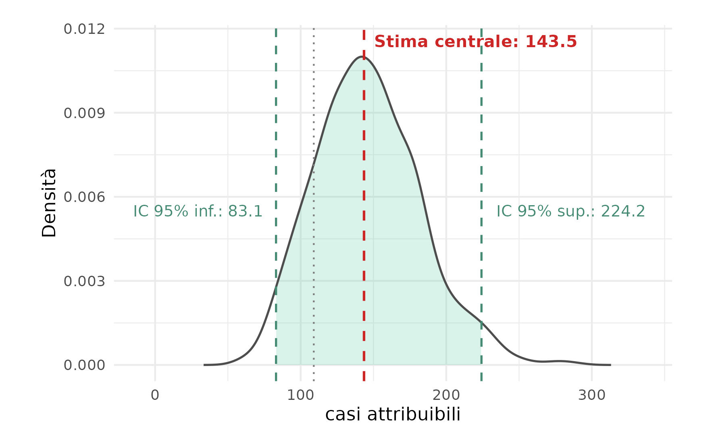

```{r}
#| label: setup
#| include: false

# ---- Caricamento delle librerie ----
library(tidyverse)
library(knitr)
#library(magick)

```

\vfill

\begin{footnotesize}

\textbf{Rigraziamenti e finanziamenti}

La frequenza del Master in \textit{"Biostatistica per la Ricerca Clinica e la Pubblicazione Scientifica (BRCPS 2026)"}, organizzato dall'\textit{Unità di Biostatistica, Epidemiologia e Sanità Pubblica (UBEP)}, presso l'\textit{Università degli Studi di Padova}, è stata resa possibile grazie al finanziamento del \textit{Ministero della Salute}, nell'ambito dei fondi complementari al PNRR, con il progetto PNC PREV-A-2022-12376981: \textit{"Aria outdoor e salute: un atlante integrato a supporto delle decisioni e della ricerca"}.

\end{footnotesize}

\newpage

*Valutazione controfattuale dell’impatto sanitario da concentrazioni atmosferiche di $\text{NO}_2$ ad alta risoluzione spaziale e propagazione dell’incertezza: il caso della Regione Veneto.*


## Sommario {.unnumbered .unlisted}

L'inquinamento atmosferico da biossido di azoto (NO2) è indicato in letteratura come un determinante ambientale per la mortalità respiratoria, la cui entità viene stimata in Regione Veneto attraverso una valutazione controfattuale di impatto sanitario.
Il *project-work* propone una stima del numero di casi attribuibili a livello di sezione censuaria ISTAT, per la popolazione in classe d'età 30+, basata sull'evidenza causale OMS/HRAPIE-2 (RR=1.05 per 10 $\mu g~m^{-3}$) e sulla modellistica ambientale a 4 km. Il differenziale di esposizione rispetto alla soglia OMS di 10 $\mu g~m^{-3}$  è stato calcolato per singola sezione censuaria prima di ogni aggregazione, per limitare la sovrastima sistematica. La stima puntuale 2025 restituisce 109 casi/anno mentre la procedura di bootstrap, che integra incertezza epidemiologica e temporale, fornisce una stima più robusta di 148 casi/anno (IC 95%: 86-211). Vengono discussi i limiti metodologici (natura ecologica, trasportabilità, scala di aggregazione) ed i possibili sviluppi verso modelli di tipo spaziale più evoluti.

\newpage

*Counterfactual health impact assessment of high-resolution ambient $\text{NO}_2$ concentrations with uncertainty propagation: the case of the Veneto Region.*

## Abstract {.unnumbered .unlisted}


Ambient nitrogen dioxide (NO2) pollution is indicated in the literature as an environmental determinant of respiratory mortality, whose magnitude is estimated for the Veneto Region through a counterfactual health impact assessment. This *project-work* estimates the number of attributable cases at the ISTAT census-section level, for the population aged 30+, based on causal evidence from WHO/HRAPIE-2 literature (RR=1.05 per 10 $\mu g~m^{-3}$ increase) and on the atmospheric dispersion model at 4 km resolution. The exposure differential relative to the WHO guideline threshold 10 $\mu g~m^{-3}$ was computed at census-section level before any aggregation, limiting systematic overestimation. The 2025 point estimate yields 109 attributable cases/year whilst the bootstrap procedure, integrating epidemiological and temporal uncertainty, provides a more robust estimate of 148 cases/year (95% CI: 86-211). Methodological limitations (ecological design, transportability, aggregation scale) and possible developments toward more evolved spatial models were finally discussed.


\newpage

## Introduzione

In questo paragrafo viene presentato un breve inquadramento degli effetti sulla salute associati all'inquinamento atmosferico ed una sintetica descrizione degli obiettivi del *"project-work"*.

L'inquinamento atmosferico è uno dei principali fattori di rischio ambientale (non individuale) per la salute umana a livello globale. Secondo le stime aggiornate dell'*Organizzazione Mondiale della Sanità (OMS)*, l'esposizione all'inquinamento atmosferico in aria ambiente (*ambient air pollution*) causa ogni anno circa *4 milioni di decessi prematuri* nel mondo, imputabili principalmente a patologie cardiovascolari, respiratorie ed oncologiche [@who_aq:2021].

A livello europeo, nonostante la progressiva riduzione dei limiti normativi ed un sensibile miglioramento dello stato di qualità dell'aria ambiente, particolarmente evidente negli ultimi 10-15 anni, l'esposizione *outdoor* all'inquinamento atmosferico rimane una criticità significativa. Le pubblicazioni dell'*Agenzia Europea per l'Ambiente* [@eea_aq:2023] e, a livello regionale dell'*Agenzia Regionale per la Prevenzione e Protezione Ambientale del Veneto* [@arpav-qa-regione:2026], evidenziano come La Pianura Padana, ed in particolare la *Regione Veneto*, costituisca un'area geografica ad altissima vulnerabilità, caratterizzata da un'elevata densità abitativa, intensa industrializzazione e condizioni meteo-climatiche che favoriscono l'accumulo degli inquinanti prodotti dai vari settori produttivi. 

Il *biossido di azoto* ($NO_2$), un inquinante emesso in prevalenza dai processi di combustione ad alta temperatura (traffico veicolare, riscaldamento domestico, attività produttive ed industriali), è stato identificato dal recente progetto *HRAPIE-2* [@hrapie-2:2025; @kasdagli:2024] come un indicatore causale [@who2019icd10] della mortalità a lungo termine per le *malattie del sistema respiratorio (codici ICD-10: J00-J99)*.

## Obiettivi

Lo studio si propone una valutazione controfattuale di impatto sanitario (VIS) del numero di eventi (casi attribuibili) associati all'esposizione a lungo termine (media annuale) ai livelli ambientali di $NO_2$, attraverso l'impiego dell'evidenza causale di letteratura (*Risk Ratio*) [@hrapie-2:2025], applicata alla popolazione in classe d'età 30+ residente nelle sezioni censuarie in Regione Veneto (ISTAT 20219.

In assenza di dati individuali georeferenziati - di fatto inaccessibili per le stringenti normative di tutela della *privacy*  -, la stima si avvale delle *sezioni censuarie ISTAT* come unità fondamentale di analisi perché rappresentano il migliore livello di granularità spaziale disponibile (accessibile) ed offrono un buon compromesso computazionale ed epidemiologico per approssimare l'esposizione all'$\text{NO}_2$ e cercare di limitare i fattori di confondimento locali (non individuali). L'interpretazione dei risultati deve comunque tenere conto della natura *aggregata* dei dati, riferendo le valutazioni di impatto sanitario a livello di popolazione e territorio (*ecological effect*), evitando l'erronea inferenza diretta a livello individuale (*ecological fallacy*).

L'obiettivo secondario dello studio è delineare un possibile percorso di sviluppo metodologico per stimare in modo robusto il numero di *casi attribuibili* associati all'inquinamento atmosferico e riconducibili a specifici scenari controfattuali in Regione Veneto. 
In prospettiva futura i risultati potranno rappresentare la base conoscitiva per definire uno strumento operativo di analisi quantitativa e di supporto decisionale alla programmazione ed alla valutazione delle Politiche Regionali in materia di Ambiente e Sanità Pubblica.

## Materiali e metodi {#sec-methods}

*Unità statistica di analisi e disegno dello studio*

L'unità statistica di analisi è rappresentata dalla sezione censuaria ISTAT definita come la minima unità territoriale di rilevazione aggregata della popolazione (43.447 sezioni in Regione Veneto da censimento ISTAT 2021). 

Si tratta di uno studio *ecologico* su base territoriale in cui tutte le variabili analizzate - esposizione atmosferica ($\text{NO}_2$), popolazione residente, stima mortalità basale -, sono sempre misurate e/o indirettamente riferite alla sezione censuaria. 
L'impiego della sezione censuaria ha l'obiettivo di cogliere l'eterogeneità spaziale dell'inquinamento atmosferico ad una risoluzione geografica il più possibile 'fine', riducendo la variabilità intra-unitaria (di gruppo) e limitando il rischio di errore di classificazione dell'esposizione (*exposure misclassification*). 

*Dataset e test statistici*

Il tasso di mortalità basale (grezzo) per *cause respiratorie* applicato alla singola sezione censuaria ISTAT è stato ricavato dai dati di *mortalità specifica stratificati a livello provinciale* per la *classe d'età 30+* (fonte ISTAT 2024).

Il *cutoff* alla classe d'età 30+ individua la *popolazione adulta* per cui sono state definite e riconosciute scientificamente specifiche funzioni di concentrazione-risposta [@hrapie-2:2025]. 

Ai fini del calcolo dei decessi attesi nella classe 30+ di ciascuna sezione censuaria ISTAT, sono stati applicati i tassi grezzi di mortalità provinciali, attribuendo a ciascuna sezione il tasso relativo alla provincia di appartenenza. Tale scelta, anziché una standardizzazione indiretta su tassi età-specifici, è dovuta alla ridotta numerosità dei decessi a livello di sezione censuaria, che avrebbe reso le stime altamente instabili. Questo approccio presuppone l'assunzione che esista una *"trasportabilità"* dei tassi di mortalità per cause respiratorie della popolazione 30+, dalle Province della Regione Veneto alle corrispondenti sezioni censuarie ISTAT.

I tassi di mortalità per cause respiratorie definiti a livello di Provincia (dato ISTAT) variano nel range compreso tra il 0.084% e il 0.140%, con una media regionale pari a circa 0.107%, cioè circa 107 casi ogni 100 000 residenti in Veneto.

I *casi attesi* sono il numero di decessi teoricamente osservabili ogni anno calcolati sulla base della popolazione  30+ esposta nelle sezioni censuarie (anno 2021) ed i tassi grezzi provinciali per la mortalità per cause respiratorie (anno 2024).

La media annuale della concentrazione ambientale di biossido di azoto $NO_2$ attribuita alle singole sezioni censuarie in Regione Veneto, è stata ottenuta tramite elaborazione geografica di *overlay*, definita da una  *media zonale pesata sulla superficie di intersezione*, tra il disegno delle sezioni censuarie ed il grigliato di output del modello euleriano di dispersione atmosferica *CAMx*. 
Il modello *CAMx*, distribuito da *Ramboll Environ* (http://www.camx.com/), è lo strumento operativo della catena modellistica SPIAIR implementata da ARPAV per la stima degli inquinanti atmosferici in Regione Veneto, su un grigliato regolare di output che ha una risoluzione orizzontale di 4 km. 

Per valutare la presenza, l'entità e la direzione dei trend temporali nelle concentrazioni medie annuali comunali di $NO_2$, sono stati utilizzati il test non parametrico di Mann-Kendall e lo stimatore della pendenza di Sen (Sen's slope). Entrambi i metodi sono robusti alla presenza di outlier e non richiedono assunzioni sulla distribuzione dei dati. Per controllare l'inflazione dei falsi positivi dovuta ai test simultanei condotti su tutti i Comuni, i $p$-value di Mann-Kendall sono stati corretti con la procedura di Benjamini-Hochberg. I trend sono considerati statisticamente significativi per valori di $p$-value aggiustato inferiori ad $\alpha = 0.05$.

La variabili demografiche aggregate per sezione censuaria, rappresentate dalla popolazione totale residente e la popolazione in classe d'età 30+, sono state ricavate dalla rielaborazione dei dati disponibili nel database ISTAT per l'anno 2021 denominato *"Basi territoriali e variabili censuarie"* (https://www.istat.it/notizia/basi-territoriali-e-variabili-censuarie/).

*Valutazione di impatto sanitario (VIS)*

L'impatto sanitario è stato valutato tramite un coefficiente di esposizione calibrato sulla stima del Rischio Relativo ($RR$) desunto dalla letteratura internazionale OMS [@hrapie-2:2025], in particolare il ($RR$) di *mortalità per cause respiratorie* (Codici ICD-10: J00-J99) nella classe d'età 30+, che risulta compreso tra il $3\%$ e il $7\%$, con un valore centrale pari al $5\%$, per ogni aumento della concentrazione di $10 \ \mu g~m^{-3}$. 
L'assunzione della stima è che esista una *"trasportabilità"* del $RR$ da letteratura OMS sulla popolazione delle sezioni censuarie ISTAT della Regione Veneto.

Per quantificare la relazione causale tra l'esposizione controfattuale ai livelli ambientali di *biossido di azoto* ($NO_2$) e la mortalità per cause respiratorie nella popolazione della classe 30+, *residente nelle sezioni censuarie ISTAT* in Regione Veneto, è stata implementata la formula di calcolo del software *WHO AirQ+*, ampiamente utilizzato nelle stime di impatto sanitario [@who_airq:2020].

I *casi attribuibili* sono la quota di casi attesi associati al differenziale di esposizione e rappresentano i casi *potenzialmente evitabili* ogni anno con l’annullamento del differenziale di esposizione controfattuale. La formula di stima dei casi attribuibili ($AC$) e della frazione attribuibile ($AF$) presuppone una relazione di tipo *log-lineare* basata sulla funzione di concentrazione-risposta:

$$AF = \frac{RR - 1}{RR} = 1 - \frac{1}{e^{\beta \cdot \Delta C}} = 1 - e^{-\beta \cdot \Delta C}$$
$$AC = N \cdot B \cdot AF = N \cdot B \cdot \left(1 - e^{-\beta \cdot \Delta C}\right)$$

dove:

- $RR = e^{\beta \cdot \Delta C}$ è il *Rischio Relativo* per un differenziale di concentrazione $\Delta C$;

- $\beta = \frac{\ln(RR_{10})}{10}$ è il coefficiente della funzione log-lineare di concentrazione-risposta scalato su un incremento base di $10 \ \mu g/m^3$;

- $N$ è la popolazione target di riferimento (es. popolazione adulta $30+$);

- $B$ è il tasso basale grezzo di incidenza dell'esito sanitario considerato (es. mortalità per cause respiratorie);

Da notare che $\Delta C$ rappresenta il differenziale di esposizione in eccesso rispetto ad una soglia di riferimento controfattuale (target). Il $\Delta C$ di esposizione in eccesso rispetto alla soglia target di $10 \ \mu g/m^3$ impiegata nel presente studio [@who_aq:2021], è stato calcolato azzerando i valori nelle sezioni con livelli di inquinamento inferiori a tale soglia, evitando così di attribuire all'inquinante un *paradossale effetto protettivo*.

La *frazione attribuibile* $AF$ è il rapporto tra casi attribuibili e casi attesi annui e rappresenta la quota di mortalità potenzialmente evitabile attraverso l’azzeramento del differenziale di esposizione controfattuale. In altri termini, $AF$ individua la percentuale dei casi osservati tra gli esposti che è causata dall'inquinamento sulla base della funzione concentrazione risposta.

Il numeratore di $AF$, il termine $(RR - 1)$, rappresenta il rischio in eccesso attribuibile al fattore ambientale (il "delta di pericolo" portato dal $NO_2$). Il denominatore $(RR)$ rappresenta la totalità del rischio "subito" dalla popolazione esposta. La frazione $\frac{RR - 1}{RR}$ indica la proporzione dei casi sanitari che non si sarebbero verificati (evitati) se l'esposizione all'inquinante fosse stata eliminata o ridotta sotto soglia.
Dal punto di vista matematico si può dimostrare [^nota] che la valutazione di impatto sanitario fatta aggregando preventivamente i dati di esposizione (a livello di sezione censuaria, di comune o di regione) tende a *sovrastimare in modo sistematico* il reale impatto rispetto ad un'analisi condotta alla massima risoluzione spaziale disponibile (idealmente individuale!) e poi aggregata a posteriori. 

Per questa motivazione, nella presente analisi il differenziale di concentrazione $\Delta C_{\text{NO}_2}$ viene calcolato e la funzione di stima dei casi attribuibili/anno $(AC)$ applicata separatamente *per ciascuna sezione censuaria*, prima di qualunque aggregazione dei risultati. *La sezione censuaria definisce l'unità geografica dei dati ambientali e sanitari con la granularità spaziale più fine effettivamente disponibile* cioè, effettivamente accessibile, considerate le limitazioni della normativa per la tutela della *privacy* dei dati sanitari individuali.

[^nota]: Si rimanda al testo riportato in Appendice per una dimostrazione rigorosa.

*Scenari di valutazione controfattuale*

L'applicazione della formula di stima di impatto alla popolazione 30+ delle sezioni censuarie del Veneto ha permesso la stima dei casi attribuibili in relazione a due differenti scenari:

- *stato attuale* ($E_{\text{reale}}$), considera la distribuzione osservata dell'esposizione ambientale all'inquinante $NO_2$ nel 2025; 

- *controfattuale* ($E_{\text{cutoff}}$), considera una esposizione pari a $NO_2 = 10 ~ \mu g~m^{-3}$ per tutte le sezioni censuarie superiori a tale valore soglia.

Il $\Delta C$ per ciascuna sezione censuaria è quindi rappresentato dalla differenza tra la concentrazione ambientale osservata (*stato attuale*) ed il valore soglia (*controfattuale*) fissato in $10 \ \mu g/m^3$, che rappresenta il livello ambientale di riferimento per la media annuale previsto dalle linee guida OMS sulla qualità dell'aria [@who_aq:2021].

*Propagazione incertezza (bootstrap)*

Per il calcolo degli intervalli di confidenza al 95% (IC 95%) della stima puntuale del numero di casi attribuibili, è stata implementata una procedura di *non-parametric bootstrap* che ha integrato due distinte fonti di incertezza:

- *epidemiologica*, valutata estraendo, ad ogni iterazione di bootstrap, il Rischio Relativo ($RR$) da una distribuzione log-normale incentrata sul valore OMS ($RR = 1{.}05$);

- *temporale*, valutata tramite l'introduzione della perturbazione conseguente all'estrazione casuale con reinserimento del valore medio annuale di $\text{NO}_2$ per ciascuna sezione censuaria, riferito alla serie storica 2019-2025.

Per garantire la correttezza metodologica della simulazione probabilistica, la procedura di bootstrap non parametrica include una fase di *calibrazione della popolazione totale*. 
Nel ricampionamento con reinserimento delle unità territoriali (sezioni di censimento), la somma delle popolazioni delle unità estratte in ogni iterazione ($P_{\text{boot}}$) varia inevitabilmente attorno alla media. Poiché le sezioni censuarie presentano dimensioni demografiche eterogenee, l'estrazione casuale di un numero maggiore di sezioni ad alta o bassa densità abitativa altera la dimensione del bacino di popolazione complessivo. 
Se quindi i casi attribuibili ($AC$) vengono calcolati direttamente su $P_{\text{boot}}$, l'ampiezza dell'intervallo di confidenza finale rifletterebbe un artefatto del campionamento demografico, anziché la vera incertezza dell'impatto sanitario.
Per risolvere questa distorsione, ogni replica bootstrap applica un fattore di calibrazione ($w_b$):
$$w_b = \frac{P_{\text{regionale}}}{P_{\text{boot}}}$$
dove $P_{\text{regionale}}$ è la popolazione 30+ effettiva della Regione Veneto (parametro fisso e privo di incertezza campionaria). 
La popolazione 30+ di ogni unità estratta viene riproporzionata ($P_{i, \text{cal}} = P_i \cdot w_b$), garantendo che in ogni replica valga esattamente il vincolo:
$$\sum_{i} P_{i, \text{cal}} = P_{\text{regionale}}$$
Gli intervalli di confidenza al 95% sono stati stimati con il metodo dei percentili (2,5° e 97,5° percentile) sulla distribuzione empirica generata dal bootstrapping.

*Software*

Le analisi statistiche sono state effettuate in ambiente di programmazione *R (v. 4.5+)* [@R_manual:2022], con l'impiego di pacchetti dedicati: `tydyverse` e `viridis` per il *data wrangling* e per la restituzione grafica, `sf` e `terra` per l'analisi e la manipolazione dei dati georeferenziati. Questo documento è stato redatto dinamicamente con *Quarto* (https://quarto.org/), sistema *open source* di pubblicazione scientifica per la trasparenza e la riproducibilità (*reproducible research*).


## Risultati

Secondo il censimento ISTAT 2021, in Regione Veneto (@fig-map-sez21) sono presenti `r format(43447, big.mark = " ")` sezioni censuarie abitate che rappresentano un totale di `r format(4847745, big.mark = " ")` residenti. La popolazione in classe d'età 30+ residente nelle sezioni censuarie del Veneto è costituita da `r format(3521995, big.mark = " ")` abitanti, che rappresentano circa il 73% della popolazione totale. 


```{r}
#| label: fig-map-sez21
#| fig-cap: "Sezioni censuarie ISTAT 2021 Regione Veneto."
#| fig-align: "center"
#| out-height: "0.4\\textheight"
#| out-width: "!\\textheight"
#| echo: false
#| fig-pos: "H"
#| 
knitr::include_graphics("./fig_tab/map_sezioni_censuarie_rv.png")

```

Le sezioni del Veneto coprono una superficie di `r format(14511, big.mark = " ")` $km^2$, con una densità media di 334 $ab~km^2$. La sezione censuaria *mediana* ha un'estensione  pari a circa 2.90 $ha$, con una densità abitativa *mediana* pari a 13.5 $ab~ha^{-1}$. 

L'unità di analisi sezione censuaria garantisce quindi, almeno in riferimento ai valori mediani, una granularità spaziale sufficientemente fine da consentire una caratterizzazione accettabile dell'entità della popolazione residente  in ciascuna sezione censuaria [^nota-ha]. Tuttavia, l'asimmetria e la multimodalità della distribuzione della popolazione impongono di considerare con attenzione la presenza di sezioni censuarie con dimensioni e densità eterogenee, non facilmente generalizzabili in termini di estensione spaziale e di popolazione residente.

[^nota-ha]: L'estensione della sezione *mediana* copre una superficie equivalente ad un quadrato di lato circa 170 m. 

In @fig-map-pop30p viene riprodotta la distribuzione spaziale della popolazione in classe d'età 30+ residente nelle sezioni censuarie della Regione Veneto (anno 2021). Le sezioni censuarie abitate da residenti in classe d'età 30+ rappresentano la quasi totalità delle sezioni in Regione Veneto. Infatti, solo 111 sezioni sul totale, pari a circa 0.25%, è abitata da popolazione in classe d'età inferiore a 30 anni (classe d'età 20-29, ISATA 2021).

La @fig-map-attesi rappresenta il numero di casi attesi/anno per cause respiratorie (codici ICD-10: J00-J99), cioè  il numero di decessi teoricamente osservabili ogni anno calcolati sulla base della popolazione esposta 30+ (sezioni censuarie ISTAT anno 2021) ed i tassi grezzi provinciali (tasso ISTAT anno 2024 per la causa di mortalità respiratoria).

E' necessario precisare che la @fig-map-pop30p e la @fig-map-attesi sono rappresentazioni geografiche di tipo "demografico" che restituiscono la popolazione *target* (a rischio) rispetto alla quale è stata effettuata la valutazione di impatto sanitario.


```{r}
#| label: fig-map-pop30p
#| fig-cap: "Popolazione classe 30+ sezioni censuarie Regione Veneto."
#| fig-align: "center"
#| out-height: "0.45\\textheight"
#| out-width: "!\\textheight"
#| echo: false
#| fig-pos: "H"
#| 
knitr::include_graphics("./fig_tab/map_sez_pop30p.png")

```

```{r}
#| label: fig-map-attesi
#| fig-cap: "Casi attesi/anno per cause respiratorie nelle  sezioni censuarie Regione Veneto."
#| fig-align: "center"
#| out-height: "0.45\\textheight"
#| out-width: "!\\textheight"
#| echo: false
#| fig-pos: "H"
#| 
knitr::include_graphics("./fig_tab/map_sezioni_attesi.png")

```


In @fig-map-no2-2025 viene rappresentata la distribuzione spaziale della concentrazione media annuale di $NO_2$ nella Regione Veneto per l'anno 2025 prodotta su grigliato regolare e risoluzione orizzontale di 4 km, tramite la catena modellistica SPIAIR. Il 2025 è l'anno più recente per cui sono disponibili stime modellistiche aggiornate e rappresenta il determinante ambientale rispetto al quale viene effettuata la valutazione di impatto sanitario sulla popolazione residente (attesi) in classe d'età 30+. 

La distribuzione spaziale delle concentrazioni ambientali di $NO_2$ relative all'anno 2025, anno di riferimento della presente valutazione, assegnate a ciascuna sezione censuaria è rappresentata in @fig-map-sez-no2-2025. 
La mappa rappresenta il livello di esposizione alle concentrazioni ambientali di $NO_2$ nell'anno 2025 per la popolazione in classe d'età 30+ residente in ciascuna sezione censuaria.

Per la Regione Veneto la popolazione delle sezioni censuarie risulta esposta ad una concentrazione *media pesata* (*PWE population weighted exposure*) di $NO_2$ pari a $16\ \mu g~m^{-3}$ mentre il valore medio pesato a livello provinciale è compreso entro l'intervallo tra circa $7\ \mu g~m^{-3}$, per la Provincia di Belluno, e circa $18\ \mu g~m^{-3}$, per le Province di Padova e Venezia.

Per una valutazione comparata dei valori di concentrazione ambientale di $NO_2$ rispetto alla serie storica registrata dal 2019 si rimanda al grafico *boxplot* in @fig-no2-boxplot-prov che riporta anche l'indicazione del valore target OMS $10\ \mu g~m^{-3}$, utilizzato come soglia di valutazione controfattuale.

Per contestualizzare in modo più preciso l'esposizione della popolazione 30+ residente nelle sezioni censuarie del Veneto rispetto ai livelli ambientali di $NO_2$, in @fig-exp-pop_prov viene riprodotta la curva cumulata della percentuale di popolazione soggetta ai livelli di concentrazione ambientale. Nel grafico sono riprodotte per semplicità solo le curve relative al 2019 ed al 2025 stratificate per Provincia che evidenziano un significativo miglioramento del livello di esposizione nel corso del tempo e contemporaneamente definiscono il "margine" necessario per raggiungere la soglia controfattuale OMS di $10\ \mu g~m^{-3}$.

Per un inquadramento generale della serie storica delle concentrazioni ambientali di $NO_2$ stimate per il periodo dal 2019 al 2025 tramite la catena modellistica implementata nella Regione Veneto ed una valutazione del trend annuale a livello comunale si rimanda ai dati e grafici riportati in Appendice (@fig-map-no2-ts e @fig-map-mk-sen).

\newpage

```{r}
#| label: fig-map-no2-2025
#| fig-cap: "Concentrazione media annuale $NO_2$ (2025) da modellistica Regione Veneto."
#| fig-align: "center"
#| out-height: "0.40\\textheight"
#| out-width: "!\\textheight"
#| echo: false
#| fig-pos: "H"
#| 
knitr::include_graphics("./fig_tab/map_no2_2025.png")

```

\vspace{-0.5em}
\nopagebreak

```{r}
#| label: fig-map-sez-no2-2025
#| fig-cap: "Concentrazione media $NO_2$ (2025) per sezioni censuarie Regione Veneto."
#| fig-align: "center"
#| out-height: "0.40\\textheight"
#| out-width: "!\\textheight"
#| echo: false
#| fig-pos: "H"
#| 
knitr::include_graphics("./fig_tab/map_sezioni_no2_2025.png")

```

\newpage

```{r}
#| label: fig-no2-boxplot-prov
#| fig-cap: "Boxplot concentrazioni $NO_2$ (2025) per sezioni censuarie Regione Veneto."
#| fig-align: "center"
#| out-height: "0.42\\textheight"
#| out-width: "!\\textheight"
#| echo: false
#| fig-pos: "H"

knitr::include_graphics("./fig_tab/no2_boxplot_no2_provincia.png")

```

\vspace{-0.5em}
\nopagebreak

```{r}
#| label: fig-exp-pop_prov
#| fig-cap: "Esposizione cumulata popolazione ai livelli ambientali $NO_2$ nel 2019 e 2025."
#| fig-align: "center"
#| out-height: "0.43\\textheight"
#| out-width: "!\\textheight"
#| echo: false
#| fig-pos: "H"

knitr::include_graphics("./fig_tab/no2_exp_pop_2019_2025_by_province.png")

```

\newpage

Il differenziale di esposizione tra il valore attuale (2025) di concentrazione di $NO_2$ in ciascuna sezione censuaria della regione Veneto rispetto al valore controfattuale  di $10\ \mu g~m^{-3}$, previsto dalle linee guida OMS per escludere significativi effetti sulla salute, è risultato in media di $5.7\ \mu g~m^{-3}$, con un valore mediano di $5.9\ \mu g~m^{-3}$ ed un range interquartile di $3.9\ \mu g~m^{-3}$.

Il differenziale appare tuttavia significativamente diversificato se consideriamo la stratificazione su base provinciale riportato in @tbl-diff-prov.

| Provincia | Media    | Mediana    | Min     | Max     | IQR     |
|:----------|---------:|-----------:|--------:|--------:|--------:|
| Belluno   |      0.2 |        0.0 |     0.0 |     1.2 |     0.3 |
| Padova    |      7.2 |        7.6 |     2.4 |     9.9 |     2.8 |
| Rovigo    |      4.0 |        3.8 |     1.8 |     6.1 |     1.0 |
| Treviso   |      6.0 |        6.0 |     0.0 |    10.7 |     2.9 |
| Venezia   |      8.1 |        8.7 |     3.4 |    11.1 |     3.2 |
| Verona    |      4.7 |        5.0 |     0.0 |     8.1 |     1.9 |
| Vicenza   |      5.2 |        5.5 |     0.0 |     9.7 |     3.9 |

: Statistiche descrittive stratificate per Provincia del differenziale di esposizione tra il livello ambientale di $NO_2$ ($\mu g~m^{-3}$) ed il valore guida OMS ($10\ \mu g~m^{-3}$). {#tbl-diff-prov}

Nella @fig-map-sez-delta-no2 viene rappresentata per le sezioni censuarie del Veneto la distribuzione spaziale del differenziale di esposizione di $NO_2$ calcolato tra il valore di concentrazione ambientale del 2025 ed il valore controfattuale previsto dalle linee guida OMS fissato nella soglia di $10\ \mu g~m^{-3}$. 

La stima di impatto sanitario per ciascuna sezione censuaria è basata su questo differenziale di esposizione tramite l'applicazione della funzione concentrazione risposta definita nella sezione -@sec-methods [Materiali e metodi](#sec-methods) ed analizzata in dettaglio nell'Appendice.


```{r}
#| label: fig-map-sez-delta-no2
#| fig-cap: "Differenziale di concentrazione ambientale $NO_2$ per anno 2025."
#| fig-align: "center"
#| out-height: "0.4\\textheight"
#| out-width: "!\\textheight"
#| echo: false
#| fig-pos: "H"


knitr::include_graphics("./fig_tab/map_sezioni_delta_no2_2025_target_oms.png")

```

La stima dei casi attribuibili per l'anno di riferimento 2025, estesa a tutte le sezioni censuarie della Regione Veneto, restituisce un valore puntuale centrale di *109 casi/anno per cause respiratorie (codici ICD-10: J00-J99) per la popolazione di età pari o superiore a 30 anni*. 

Assumendo il valore centrale del Rischio Relativo di letteratura OMS ($RR = 1{.}05$), la stima determina per l'intera regione una frazione attribuibile (AF) pari al 2.86% dei casi attesi. Applicando gli estremi dell'intervallo di incertezza del $RR$ ($1{.}03 - 1{.}07$), il carico di mortalità varia deterministicamente da un valore minimo di 66.3 casi/anno ($\text{AF}_{\text{low}} = 1{.}74\%$) a un massimo di 150.0 casi/anno ($\text{AF}_{\text{upp}} = 3{.}95\%$).

Nella @fig-map-sez-af viene riprodotta la frazione attribuibile (AF) nelle szioni censuarie del Veneto, cioè il rapporto tra casi attribuibili e casi attesi annui che rappresenta la frazione di casi per malattie respiratorie potenzialmente evitabile attraverso l’azzeramento del differenziale di esposizione rispetto al controfattuale OMS.

```{r}
#| label: fig-map-sez-af
#| fig-cap: "Frazione attribuibile (AF) nelle sezioni della Regione Veneto (anno 2025)."
#| fig-align: "center"
#| out-height: "0.4\\textheight"
#| out-width: "!\\textheight"
#| echo: false
#| fig-pos: "H"


knitr::include_graphics("./fig_tab/map_AF_sezioni_no2_2025.png")

```


Nella @tbl-ac-prov viene riportato per l'anno 2025 il dettaglio stratificato per Provincia del numero di casi attesi, del valore centrale ($\text{AC}$), degli estremi inferiore ($\text{AC}_{\text{low}}$) e superiore ($\text{AC}_{\text{upp}}$) dei casi attribuibili e della frazione attribuibile ($\text{AF}$).


| Provincia | Attesi | AC | AF | $AC_{low}$ | $AC_{upp}$ |
| :--- | ---: | ---: | ---: | ---: | ---: |
| Belluno | 209 | 0.21 | 0.0010 | 0.13 | 0.29 |
| Padova | 766 | 27.10 | 0.0354 | 16.50 | 37.30 |
| Rovigo | 148 | 2.84 | 0.0192 | 1.73 | 3.92 |
| Treviso | 587 | 17.40 | 0.0297 | 10.60 | 24.00 |
| Venezia | 626 | 23.90 | 0.0381 | 14.60 | 32.80 |
| Verona | 797 | 19.50 | 0.0245 | 11.90 | 26.90 |
| Vicenza | 668 | 17.70 | 0.0265 | 10.80 | 24.40 |

: Stima del numero di casi attribuibili/anno (AC) stratificati per Provincia (anno 2025). {#tbl-ac-prov}

Occorre tuttavia precisare che gli estremi $\text{AC}_{\text{low}}$ e $\text{AC}_{\text{upp}}$ riportati nella @tbl-ac-prov rappresentano dei valori deterministici, calcolati direttamente a partire dagli intervalli di confidenza del $RR$ da letteratura OMS ($1.03 - 1.07$). 

Per tentare di superare questa rigidità deterministica ed estendere l'analisi a una distribuzione empirica della variabilità della stima, è stata implementata la procedura di *non-parametric bootstrap* descritta nella sezione @sec-methods. 

L'approccio deterministico fornisce un'unica stima puntuale dei casi attribuibili ($AC$) mentre l'applicazione del bootstrap non parametrico permette di propagare l'incertezza parametrica del rischio relativo ($RR$) e della variabilità temporale delle esposizioni, consentendo una caratterizzazione probabilistica dell'impatto sanitario e fornendo intervalli di confidenza al $95\%$ indispensabili per la valutazione del rischio in Sanità Pubblica.

La @fig-boot-spattemp illustra la curva di densità di probabilità associata alla distribuzione empirica dei casi attribuibili generata con il processo di bootstrapping. La linea tratteggiata rossa identifica la stima centrale della distribuzione a circa 148 casi/anno. Le due linee verticali tratteggiate in verde delimitano l'intervallo di confidenza empirico al 95%: l'estremo inferiore ($\text{IC } 95\%\text{ inf.}$) si attesta a circa 86 casi/anno ($2{.}5^\circ$ percentile), mentre l'estremo superiore ($\text{IC } 95\%\text{ sup.}$) raggiunge circa i 211 casi/anno ($97{.}5^\circ$ percentile). L'area ombreggiata sottesa alla curva racchiude la massa di probabilità centrale corrispondente a tale intervallo. Infine, la linea punteggiata (in grigio) corrispondente a circa 109 casi/anno rappresenta l'entità della stima discussa in precedenza e riferita alla stima puntuale per l'anno 2025.


```{r}
#| label: fig-boot-spattemp
#| fig-cap: "Stima bootstrap (AC) casi atrribuibili/anno in Regione Veneto."
#| fig-align: "center"
#| out-height: "0.4\\textheight"
#| out-width: "!\\textheight"
#| echo: false
#| fig-pos: "H"



```

L'incremento del valore centrale della distribuzione bootstrap (circa $148$ casi/anno) rispetto alla stima deterministica riferita all'anno 2025 (circa $109$ casi/anno) è riconducibile all'effetto della variabilità introdotta con il processo di bootstrapping e determinata dall'inclusione delle concentrazioni di $\text{NO}_2$ degli anni precedenti (2019-2024), storicamente più elevate rispetto al 2025, integrata con la propagazione *log-normale* del rischio epidemiologico $RR$ che ha l'effetto di traslare la distribuzione empirica verso valori di impatto sanitario medio complessivamente più elevati.

I percentili $2{.}5^\circ$ e $97{.}5^\circ$ della distribuzione empirica generata con il processo di bootstrap definiscono l'intervallo di confidenza al 95% (IC 95%) e forniscono una quantificazione dell'incertezza più robusta rispetto ai calcoli deterministici fissi riferiti solo al 2025.

In @tbl-boot sono riportate le metriche descrittive della distribuzione empirica bootstrap in termini di numero di casi attribuibili/anno (AC), frazione attribuibile/anno (AF).

```{r}
#| label: tbl-boot
#| tbl-cap: "Sintesi metriche della distribuzione bootstrap probabilistica."
#| echo: false
#| message: false
#| warning: false


summary_table <- read_csv('./fig_tab/tbl_bootstrap_summary_short.csv')

summary_table  |> 
  mutate(across(c(media, mediana, sd, ci_025, ci_975, ci_95), ~ round(.x, 2))) |> 
  kable(
    col.names = c("Metrica", "Media", "Mediana", "SD", "IC 2.5%", "IC 97.5%", "IC 95%"),
    align = c("l", "c", "c", "c", "c", "c", "c")
  )
  
```

## Discussione e conclusioni

Dal punto di vista dell'interpretazione epidemiologica dei risultati, la stima ottenuta dalla valutazione di impatto sanitario rappresenta il numero di *casi/anno teorici*, cioè i decessi evitabili nell'eventualità in cui tutte le sezioni censuarie del Veneto siano esposte ad un livello di concentrazione ambientale di $NO_2 \leq 10\ \mu g~m^{-3}$, soglia OMS stabilita dalle attuali evidenze scientifiche per escludere significativi (misurabili) effetti sanitari (malattie per cause respiratorie codici ICD-10: J00-J99).

Il confronto tra la stima puntuale riferita all'anno 2025 (circa 109 casi/anno) e la stima centrale ottenuta dalla procedura di bootstrap spazio-temporale (circa 148 casi/anno, IC 95% 86–211) mette in luce un aspetto metodologico significativo: affidarsi al solo dato deterministico dell'ultimo anno disponibile rischia di sottostimare il carico sanitario atteso, poiché non tiene conto né della variabilità storica dell'esposizione (concentrazioni di NO2 nel periodo 2019-2025, sistematicamente più elevate nei primi anni della serie), né dell'incertezza epidemiologica associata al Rischio Relativo di letteratura.

Da un punto di vista di supporto alle decisioni di Sanità Pubblica, la stima più prudente e metodologicamente robusta da comunicare ai decisori è quindi quella ottenuta dal bootstrap che integra le due fonti di incertezza (epidemiologica, temporale).

D'altro canto l'analisi dettagliata per l'anno 2025 evidenzia alcuni aspetti interessanti che derivano da una marcata eterogeneità territoriale del carico sanitario attribuibile (@tbl-ac-prov). 
Le province di Padova e Venezia concentrano la quota maggiore di casi attribuibili (rispettivamente circa 27 e 24 casi/anno, con AF pari al 3,5% e 3,8% dei casi attesi), coerentemente con i più alti differenziali di esposizione rispetto alla soglia controfattuale OMS (@tbl-diff-prov). Al contrario, la provincia di Belluno presenta un impatto sanitario pressoché trascurabile (AF = 0,1%), risultato atteso vista la ridotta pressione emissiva e le caratteristiche orografiche dell'area, meno soggetta all'accumulo tipico del Bacino Padano. 

Questa distribuzione disomogenea conferma che eventuali politiche regionali di riduzione dell'esposizione a $NO_2$ potrebbero ottenere il maggior beneficio sanitario se prioritariamente indirizzate alle aree di pianura a maggiore pressione antropica (densità abitativa, riscaldamento domestico, traffico veicolare, insediamenti produttivi), rispetto ad un approccio indifferenziato sull'intero territorio regionale.

*Limiti dello studio*

Alcuni limiti metodologici vanno esplicitati ed evidenziati:

- *natura ecologica dello studio*: l'unità di analisi è la sezione censuaria ed i risultati vanno interpretati a livello aggregato di popolazione, evitando l'inferenza diretta a livello individuale (*ecological fallacy*); in particolare, tutti i confondenti individuali rimangono non risolti fino a quando si opera nell'ambito di stime di gruppo;

- *trasportabilità delle stime*: sia il Rischio Relativo (derivato dalla letteratura internazionale OMS/HRAPIE-2), sia i tassi di mortalità di base (stimati a livello provinciale e attribuiti alle sezioni censuarie) presuppongono un'ipotesi di trasportabilità che non tiene conto di eventuali differenze locali nella suscettibilità della popolazione, nella composizione demografica o nella qualità delle cure sanitarie;

- *aggregazione spaziale e sovrastima sistematica*: come dimostrato in Appendice, calcolare l'impatto sanitario su dati di esposizione pre-aggregati porterebbe a una sovrastima sistematica rispetto a un'analisi condotta alla massima risoluzione disponibile; per questo motivo la stima dei casi attribuibili è stata effettuata a livello di singola sezione censuaria prima di ogni aggregazione, mitigando (ma non eliminando del tutto, vista la risoluzione di 4 km del modello CAMx) questo tipo di bias;

- *risoluzione del dato di esposizione*: il grigliato modellistico SPIAIR/CAMx a 4 km, per quanto rappresenti lo strumento operativo di riferimento in Regione Veneto, non è in grado di catturare completamente la variabilità di micro-scala, con un possibile effetto di *exposure misclassification* residua anche al netto della disaggregazione per sezione censuaria;

- *singolo inquinante*: la valutazione si concentra esclusivamente su $NO_2$, mentre nella realtà la popolazione è co-esposta a una miscela di inquinanti (in particolare $PM_{2.5}$) con possibili effetti sinergici o di confondimento non catturabili dal  modello deterministico concentrazione-risposta;

- *scelta della soglia controfattuale*: il valore di $10\ \mu g~m^{-3}$ riflette le linee guida OMS 2021, ma scenari controfattuali alternativi (es. riduzioni percentuali uniformi, o soglie nazionali/regionali) potrebbero restituire stime di impatto sensibilmente diverse.

- *assunzione di indipendenza spaziale* tra le sezioni censuarie che non viene cattaurata dall'attuale implementazione della procedura di bootstrap.

- *trattazione dell'autocorrelazione temporale*: i valori di esposizione osservati in anni successivi per una medesima sezione censuaria non sono tra loro indipendenti, ma presentano una struttura di autocorrelazione temporale che l'attuale procedura di bootstrap tenta di catturare tramite il ricampionamento della serie storica 2019-2025, senza tuttavia modellarla esplicitamente attraverso un impianto di serie storiche o processi spazio-temporali dedicati.

*Conclusioni metodologiche e possibili sviluppi futuri*

Nonostante questi limiti, lo studio conferma che l'esposizione a $NO_2$ resta un determinante ambientale non trascurabile della mortalità per cause respiratorie in Regione Veneto, con un carico sanitario stimato tra le 86 e le 211 unità/anno (IC 95% bootstrap) concentrato prevalentemente nelle aree di pianura a maggiore densità abitativa e pressione antropica.

Il percorso metodologico proposto - disaggregazione a livello di sezione censuaria, propagazione dell'incertezza tramite bootstrap rappresenta una base replicabile per la costruzione di uno strumento quantitativo di supporto alla programmazione regionale in materia di Ambiente e Sanità Pubblica.

La quantificazione dell'impatto sanitario da inquinamento atmosferico a livello di sezioni censuarie presenta tuttavia rilevanti sfide analitiche, legate principalmente alla presenza di *confondimento spaziale* e *collinearità* tra le caratteristiche geografiche ed i livelli espositivi [@ramsey_ps:2019]. Per tentare di superare questi limiti è necessario adottare un framework di *inferenza causale* [@dominici_cas_evi:2017], con l'obiettivo di isolare almeno il ruolo dei confondenti socio-demografici e territoriali (in mancanza di dati individuali utilizzabili per questo scopo).

Sviluppi futuri dello studio potranno riguardare:

- l'adozione di tecniche di inferenza causale più robuste (propensity score, IPTW, g-computation) rispetto all'approccio descrittivo-deterministico qui adottato, in modo da rafforzare l'interpretazione causale del legame tra esposizione e impatto sanitario;

- l'impiego di uno smussamento bayesiano empirico (*Empirical Bayes Smoothing*) per la stima del tasso di mortalità rifierito a piccole unità territoriali (comuni/sezioni), eventualmente integrato con la modellazione della dipendenza spaziale;

- l'inserimento esplicito dell'incertezza associata ai tassi di mortalità di base e alla stima della popolazione residente in ciascuna sezione censuaria;

- l'adozione di strutture autoregressive spaziali (*CAR/MICAR, Conditional Autoregressive* / *Multivariate Conditional Autoregressive*) con *prior* spaziali, strumenti avanzati per l'analisi di dati distribuiti su un territorio suddiviso in regioni (comuni, province, pixel di griglia), che riflettono la tendenza di aree geografiche vicine a condividere caratteristiche ambientali e di popolazione simili.

Un limite strutturale degli studi ecologici è il *Modifiable Areal Unit Problem (MAUP)*, secondo cui la dimensione e i confini delle aree analizzate possono alterare i risultati statistici.
Questo si verifica innanzitutto per via dell'*effetto di scala*: allargando l'unità d'analisi — ad esempio passando dai micro-dati delle sezioni censuarie all'aggregato del comune — i dati tendono a mediarsi tra loro. Questa aggregazione appiattisce la variabilità locale e rischia di nascondere i picchi di esposizione presenti nei singoli quartieri.
A questo si affianca l'*effetto di zonalità*, per cui la scelta di come tracciare i confini territoriali rimane un'arbitrarietà geografica: le barriere amministrative tra comuni non riflettono la reale dispersione fisica del $NO_2$, che segue dinamiche ambientali (fisico-chmiche) del tutto indipendenti.

Il superamento di questi limiti strutturali potrà essere perseguito attraverso l'adozione di un approccio che integri tecniche di Bayesian Smoothing per la stabilizzazione dei tassi di mortalità nelle piccole aree unitamente a strutture autoregressive spaziali (es. modelli CAR/MICAR, Besag-York-Mollié) per la modellazione esplicita della dipendenza di vicinato [@blangiardo_cameletti:2015] o l'analisi dell'autocorrelazione spaziale (I di Moran), al fine di modellare esplicitamente la dipendenza geografica ad alta risoluzione e la struttura di covarianza residua.

Parallelamente, potrà essere considerata l'estensione del disegno verso un *framework* di inferenza causale spaziale (*spatial causal inference*) [@akbari_sp_inf:2023]. Tale approccio consentirebbe di formalizzare esplicitamente l'indipendenza tra le unità di analisi. Infatti, il calcolo dei casi attribuibili applicato separatamente a ciascuna sezione censuaria presuppone che l'esito atteso di un'unità non dipenda dal livello di esposizione delle sezioni limitrofe - un'approssimazione operativa ragionevole, ma poco verosimile rispetto alla natura diffusiva degl inquinanti ($NO_2$) nell'aria ambiente, che genera fenomeni di *spillover* spaziale tra sezioni censuarie contigue.

## Bibliografia

::: {#refs}
:::

\newpage

## Appendice {.unnumbered}

**Funzione per la stima dei casi attribuibili**

Questa sezione dell'Appendice paragrafo riprende e sviluppa la nota *[1]* riportata nel paragrafo  -@sec-methods [Materiali e metodi](#sec-methods), fornendo un inquadramento rispetto alle caratteristiche della funzione di stima dei casi attribuibili $AC$, e conseguentemente della frazione attribuibile $AF$.

Dal punto di vista matematico, si possono notare alcune interessanti proprietà della funzione di stima di impatto sanitario utilizzata nel presente studio (ed implementata nel software *AirQ+*), che ha delle significative implicazioni di tipo numerico e, conseguentemente, epidemiologico: 

$$f(\Delta C) = 1 - e^{-\beta \cdot \Delta C}$$

Se, infatti, calcoliamo la derivata prima e seconda della funzione rispetto a $\Delta C$, si ottiene:
$$f'(\Delta C) = \beta e^{-\beta \cdot \Delta C} > 0$$
$$f''(\Delta C) = -\beta^2 e^{-\beta \cdot \Delta C} < 0$$
La derivata prima $f'(\Delta C) > 0$ è strettamente positiva, e quindi, la funzione è *monotonicamente crescente*: all'aumentare della riduzione di inquinante ($\Delta C$), i casi evitati aumentano sempre. 
La derivata seconda $f''(\Delta C) < 0$ è strettamente negativa, e quindi, la funzione è *strettamente concava*, cioè con la curvatura rivolta verso il basso, e caratterizzata da rendimenti marginali decrescenti.

In altri termini, piccole riduzioni iniziali delle concentrazioni di inquinante generano benefici sanitari sproporzionatamente più elevati rispetto a riduzioni successive della stessa entità, creando una crescita iniziale molto ripida dell'impatto evitato che tende poi a stabilizzarsi (appiattirsi) man mano che il $\Delta C$ aumenta ulteriormente.

La @fig-f-who riproduce graficamente l'andamento della funzione $f(\Delta C)$ nell'intervallo $\Delta C \in [0, 100] ~\mu g~ m^{-3}$, rendendo visivamente evidenti la monotonia crescente e la concavità appena dimostrate analiticamente, con la retta tangente nell'origine riportata come riferimento per apprezzare meglio il progressivo rallentamento dei rendimenti marginali.

```{r}
#| label: fig-f-who
#| echo: false
#| message: false
#| warning: false
#| fig-cap: Funzione di stima dell'impatto sanitario in funzione di $\Delta C$
#| fig-height: 3
#| fig-width: 5
#| fig-pos: "H"


# grafico calibrato per RR = 1.05 per 10 µg/m3
# quindi β = ln(1.05)/10 ≈ 0.004879

# Calcolo di beta a partire dall'RR fornito (1.05 per 10 ug/m3)
RR <- 1.05
beta <- log(RR) / 10

# Funzione di impatto sanitario
f <- function(delta_c, beta) 1 - exp(-beta * delta_c)

# Griglia di valori di Delta C
delta_c_seq <- seq(0, 100, by = 0.1)
df <- data.frame(
  delta_c = delta_c_seq,
  f_val = f(delta_c_seq, beta)
)

ggplot(df, aes(x = delta_c, y = f_val)) +
  geom_line(linewidth = 0.8, color = "#2c7fb8") +
  geom_abline(intercept = 0, slope = beta, linetype = "dashed", color = "grey60", linewidth = 0.4) +
  labs(
    x = expression(Delta*C~(mu*g/m^3)),
    y = expression(f(Delta*C) == 1 - e^{-beta*Delta*C}),
    title = "Funzione di stima impatto sanitario",
    subtitle = expression(paste(beta, " = ln(1.05)/10 ", "=", " 0.00488"))
  ) +
  theme_minimal(base_size = 11) +
  theme(
    #plot.title = element_text(face = "bold", size = 12),
    plot.subtitle = element_text(size = 10, color = "grey30")
  )

```

La *disuguaglianza di Jensen* [@casella2002statistical] mette in relazione il valore atteso di una funzione con la funzione del valore atteso. Se indichiamo con $\varphi$ una *funzione concava* e con $X$ una variabile casuale con valore atteso finito, vale la seguente relazione:

$$E[\varphi(X)] \le \varphi(E[X])$$

Poiché $f(\Delta C)$ è strettamente concava, come dimostrato in precedenza, possiamo applicare questa disuguaglianza ponendo $\varphi = f$ e trattando $\Delta C$ come una variabile casuale che descrive la *variabilità spaziale* dell'esposizione tra le unità territoriali (sezioni censuarie) che compongono l'area di studio:

$$E[f(\Delta C)] \le f(E[\Delta C])$$
In termini epidemiologici, questa disuguaglianza mette a confronto due strategie di stima alternative:

- **$E[f(\Delta C)]$**: il beneficio sanitario calcolato separatamente per ciascuna sezione censuaria (usando il $\Delta C$ specifico di ciascuna unità) e poi mediato — cioè un'analisi che rispetta la *reale eterogeneità spaziale* dell'esposizione;

- **$f(E[\Delta C])$**: il beneficio calcolato applicando la formula un'unica volta alla riduzione *media complessiva* dell'area (comune, provincia o regione), trattando l'intera popolazione come se fosse esposta in modo omogeneo a quel valore medio.

La disuguaglianza implica che la prima quantità è *sempre minore o al più uguale* alla seconda. 
L'uguaglianza vale solo nel caso limite in cui $\Delta C$ sia costante su tutte le unità territoriali (assenza di eterogeneità spaziale reale) — condizione praticamente mai verificata nei dati di inquinamento ambientale, che presentano tipicamente forte variabilità locale.

Intuitivamente, il motivo è lo stesso individuato analizzando la concavità di $f$: dato che i rendimenti marginali sono decrescenti, le sezioni con riduzioni molto elevate di inquinante contribuiscono all'impatto medio meno di quanto le sezioni con riduzioni modeste vi contribuiscano in proporzione, nella media aggregata.

Un esempio numerico semplice chiarisce bene il meccanismo.
Si considerino due sole sezioni censuarie con $\Delta C_1 = 2 \ \mu g/m^3$ e $\Delta C_2 = 18 \ \mu g/m^3$
($\overline{\Delta C} = 10$) e $\beta = 0{,}01$. 

Si ottiene:
$$f(\Delta C_1) = f(2) = 1 - e^{-0{,}02} \approx 0{,}0198$$
$$f(\Delta C_2) = f(18) = 1 - e^{-0{,}18} \approx 0{,}1647$$

con media $E[f(\Delta C)] \approx 0{,}0923$, mentre:

$$f(\overline{\Delta C}) = f(10) = 1 - e^{-0{,}1} \approx 0{,}0952$$

cioè, la stima aggregata è, seppur di poco, superiore.

Il grafico di una funzione concava si trova sempre *al di sopra* della corda che congiunge due suoi punti qualsiasi. 
Nell'esempio numerico, $\Delta C = 10$ è esattamente il punto medio tra $\Delta C_1 = 2$ e $\Delta C_2 = 18$; di conseguenza, il valore della corda in quel punto coincide con la media dei due benefici calcolati separatamente, $E[f(\Delta C)] \approx 0{,}0923$.
Poiché $f$ è concava, il valore della funzione calcolato direttamente in quel punto, $f(\overline{\Delta C}) = f(10) \approx 0{,}0952$, si colloca *sopra* la corda, cioè sopra la media dei due benefici individuali.

In altre parole: il rallentamento dei rendimenti marginali per riduzioni elevate ($\Delta C_2 = 18$) fa sì che il beneficio calcolato punto per punto e poi mediato ($E[f(\Delta C)]$) non raggiunga mai il beneficio ottenuto applicando la formula al valore medio aggregato ($f(\overline{\Delta C})$) - ed è proprio questo scarto, *sistematico* per ogni funzione strettamente concava, a determinare la sovrastima di *tipo matematico* conseguente all'approccio di tipo aggregato.


**Serie storica $NO_2$ da modellistica regionale**

In questa sezione dell'Appendice viene proposta un breve inquadramento della serie storica delle concentrazioni ambientali di $NO_2$ in Regione Veneto che sono state stimate per il periodo dal 2019 al 2025 tramite la catena modellistica SPIAIR.

In @fig-map-no2-ts sono riprodotte le mappe di distribuzione spaziale delle concentrazioni medie annuali di $NO2$ da cui si un sensibile e stabile decremento nel tempo dei valori ambientali, con i livelli medi più bassi registrati nel 2025.

```{r}
#| label: fig-map-no2-ts
#| fig-cap: "Serie storica concentrazioni NO2 dal 2019 al 2025."
#| fig-align: "center"
#| out-height: "0.65\\textheight"
#| out-width: "!\\textheight"
#| echo: false

knitr::include_graphics("./fig_tab/map_no2_ts_rv.png")

```

La @fig-map-mk-sen riproduce la distribuzione geografica dei risultati del test non parametrico di *Mann-Kendall* e della stima della pendenza di Sen (*Sens'slope*) per le concentrazioni ambientali di $NO_2$ (medie annuali)  raggruppate per Comune in Regione Veneto. 

Nella mappa i colori all'interno dei Comuni indicano la pendenza della retta non parametrica, con valori negativi (in colore graduato blu) del coefficiente angolare con un *trend decrescente nel tempo*, mentre i confini amministrativi dei Comuni in evidenza (con bordo ispessito) indicano un trend temporale statisticamente significativo ($\alpha = 0.05$).

```{r}
#| label: fig-map-mk-sen
#| fig-cap: "Trend annuale NO2 comunale (2019-2025). Per una dettagliata descrizione dei colori e della simbologia utilizzata nella rappresentazione si rimanda al testo."
#| fig-align: "center"
#| out-height: "0.6\\textheight"
#| out-width: "!\\textheight"
#| echo: false
#| fig-pos: "H"

knitr::include_graphics("./fig_tab/map_mk_sen_no2.png")

```

Al fine di contenere l'inflazione dei falsi positivi derivante dall'esecuzione simultanea dei test su tutti i Comuni, i $p$-value di Mann-Kendall sono stati corretti mediante la procedura di Benjamini-Hochberg (False Discovery Rate - FDR), garantendo un bilanciamento ottimale tra il controllo delle false scoperte e la potenza statistica della stima della pendenza di Sen. Si segnala tuttavia che l'analisi non include una verifica della struttura di autocorrelazione spaziale e temporale nei dati; pertanto, l'attuale rappresentazione cartografica presenta un preciso limite metodologico e va interpretata con molta cautela, attribuendole un valore esclusivamente indicativo e non confermativo.
