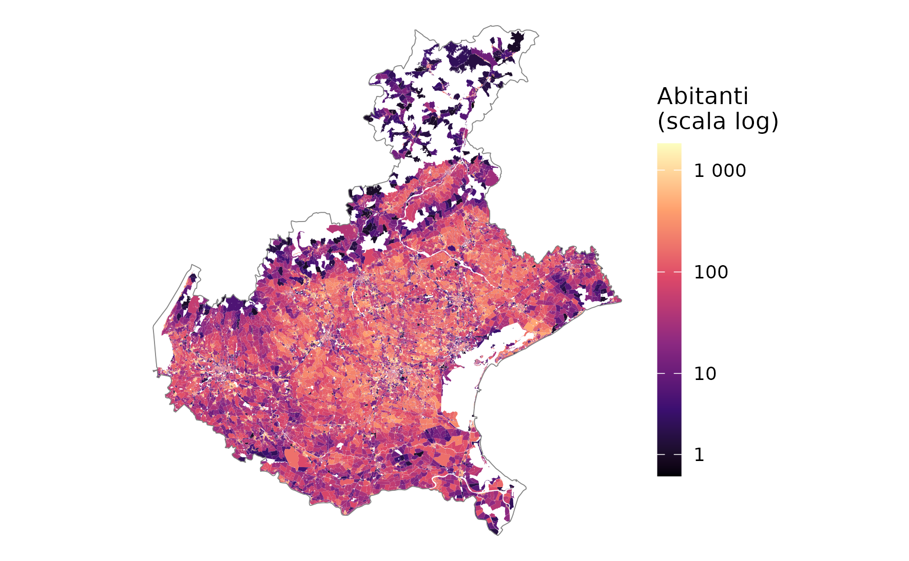
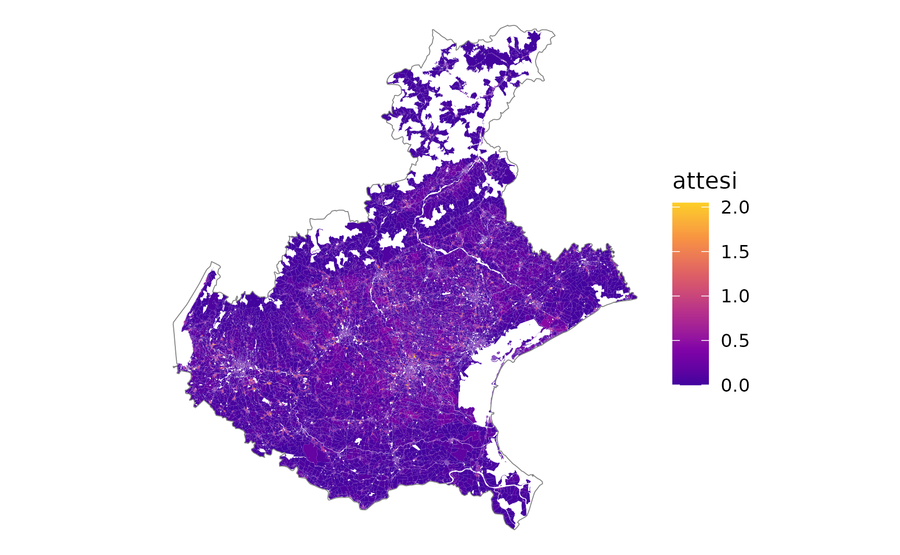
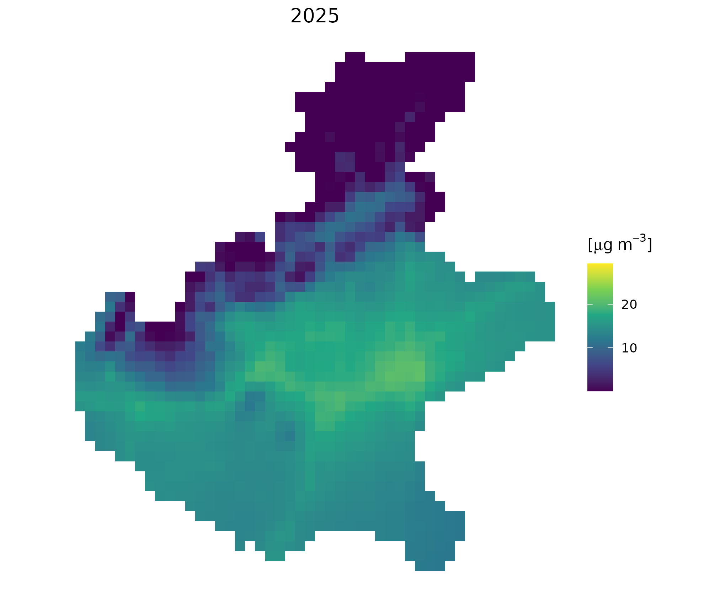
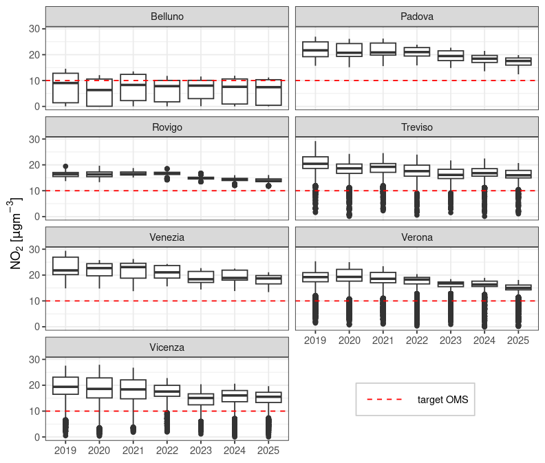
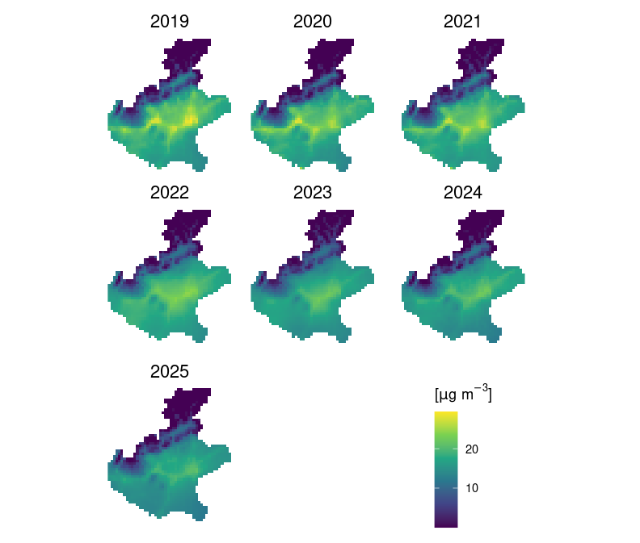
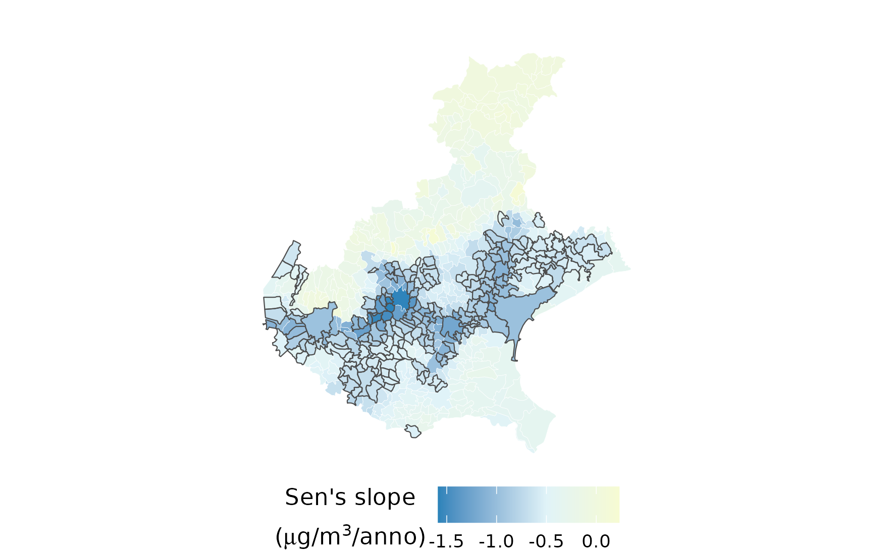

```{r}
#| label: setup
#| include: false

# ---- Caricamento delle librerie ----
library(tidyverse)
library(knitr)
library(magick)

```

\newpage

Opzione 1, concisa

*Stima controfattuale dell'impatto sanitario delle concentrazioni atmosferiche di $\text{NO}_2$ in Regione Veneto.*

Opzione 2, preferibile ad opzione 1?

*Valutazione controfattuale dell’impatto sanitario da concentrazioni atmosferiche di $\text{NO}_2$ ad alta risoluzione spaziale e propagazione dell’incertezza: il caso della Regione Veneto.*


Opzione 3, migliore? 

*Concentrazioni atmosferiche di $\text{NO}_2$ ed impatto sanitario in Regione Veneto: una stima controfattuale ad alta risoluzione spaziale con propagazione dell’incertezza.*

## Sommario {.unnumbered}

150 parole

## Abstract {.unnumbered}

150 words


\vfill

\begin{footnotesize}

\textbf{Rigraziamenti e finanziamenti}

La frequenza del Master in \textit{"Biostatistica per la Ricerca Clinica e la Pubblicazione Scientifica (BRCPS 2026)"}, organizzato dall'\textit{Unità di Biostatistica, Epidemiologia e Sanità Pubblica (UBEP)}, presso l'\textit{Università degli Studi di Padova}, è stata resa possibile grazie al finanziamento del \textit{Ministero della Salute}, nell'ambito dei fondi complementari al PNRR, con il progetto PNC PREV-A-2022-12376981: \textit{"Aria outdoor e salute: un atlante integrato a supporto delle decisioni e della ricerca"}.

\end{footnotesize}

\newpage

## Introduzione

In questo paragrafo viene presentato un breve inquadramento degli effetti sulla salute associati all'inquinamento atmosferico ed una sintetica descrizione degli obiettivi del *"project-work"*.

L'inquinamento atmosferico è uno dei principali fattori di rischio ambientale (non individuale) per la salute umana a livello globale. Secondo le stime aggiornate dell'*Organizzazione Mondiale della Sanità (OMS)*, l'esposizione all'inquinamento atmosferico in aria ambiente (*ambient air pollution*) causa ogni anno circa *4 milioni di decessi prematuri* nel mondo, imputabili principalmente a patologie cardiovascolari, respiratorie ed oncologiche [@who_aq:2021].

A livello europeo, nonostante la progressiva riduzione dei limiti normativi ed un sensibile miglioramento dello stato di qualità dell'aria ambiente, particolarmente evidente negli ultimi 10-15 anni, l'esposizione *outdoor* all'inquinamento atmosferico rimane una criticità significativa. Le pubblicazioni dell'*Agenzia Europea per l'Ambiente* [@eea_aq:2023] e, a livello regionale dell'*Agenzia Regionale per la Prevenzione e Protezione Ambientale del Veneto* [@arpav-qa-regione:2026], evidenziano come il Bacino Aerologico Padano, ed in particolare la *Regione Veneto*, costituisca un'area geografica ad altissima vulnerabilità, caratterizzata da un'elevata densità abitativa, intensa industrializzazione e condizioni meteo-climatiche che favoriscono l'accumulo degli inquinanti prodotti dai vari settori produttivi. 

Il *biossido di azoto* ($NO_2$), un inquinante emesso in prevalenza dai processi di combustione ad alta temperatura (traffico veicolare, riscaldamento domestico, attività produttive ed industriali), è stato identificato dal recente progetto *HRAPIE-2* [@hrapie-2:2025; @kasdagli:2024] come un indicatore causale [@who2019icd10] della mortalità a lungo termine per le *malattie del sistema respiratorio (codici ICD-10: J00-J99)*.

## Obiettivi

Lo studio si propone una valutazione controfattuale di impatto sanitario (VIS) del numero di eventi (casi attribuibili) associati all'esposizione a lungo termine (media annuale) ai livelli ambientali di $NO_2$, attraverso l'impiego dell'evidenza causale di letteratura (*Risk Ratio*) [@hrapie-2:2025], applicata alla popolazione in classe d'età 30+ residente nelle sezioni censuarie in Regione Veneto (ISTAT 20219.

In assenza di dati individuali georeferenziati - di fatto inaccessibili per le stringenti normative di tutela della *privacy*  -, la stima si avvale delle *sezioni censuarie ISTAT* come unità fondamentale di analisi perché rappresentano il migliore livello di granularità spaziale disponibile (accessibile) ed offrono un buon compromesso computazionale ed epidemiologico per approssimare l'esposizione all'$\text{NO}_2$ e cercare limitare i fattori di confondimento locali (non individuali). L'interpretazione dei risultati deve comunque tenere conto della natura *aggregata* dei dati, riferendo le valutazioni di impatto sanitario a livello *aggregato* di popolazione e territorio (*ecological effect*), evitando l'erronea inferenza diretta a livello individuale (*ecological fallacy*).

L'obiettivo secondario dello studio è delineare un possibile percorso di sviluppo metodologico per stimare in modo robusto il numero di *casi attribuibili* associati all'inquinamento atmosferico e riconducibili a specifici scenari controfattuali in Regione Veneto. 
In prospettiva futura i risultati possono rappresentare la base conoscitiva per definire uno strumento operativo di analisi quantitativa e di supporto decisionale alla programmazione ed alla valutazione delle Politiche Regionali in materia di Ambiente e Sanità Pubblica.

## Materiali e metodi {#sec-methods}

*Unità statistica di analisi e disegno dello studio*

L'unità statistica di analisi è rappresentata dalla sezione censuaria ISTAT definita come la minima unità territoriale di rilevazione aggregata della popolazione (43.447 sezioni in Regione Veneto da censimento ISTAT 2021). 

Si tratta di uno studio *ecologico* su base territoriale in cui tutte le variabili analizzate - esposizione atmosferica ($\text{NO}_2$), popolazione residente, stima mortalità basale -, sono sempre misurate e riferite alla sezione censuaria. 
L'impiego della sezione censuaria ha l'obiettivo di cogliere l'eterogeneità spaziale dell'inquinamento atmosferico ad una risoluzione geografica il più possibile 'fine', riducendo la variabilità intra-unitaria (di gruppo) e limitando il rischio di errore di classificazione dell'esposizione (*exposure misclassification*). 

*Dataset e test statistici*

Il tasso di mortalità basale (grezzo) per *cause respiratorie* applicato alla singola sezione censuaria ISTAT è stato ricavato dai dati di *mortalità specifica stratificati a livello provinciale* per la *classe d'età 30+* (fonte ISTAT 2024).

Il *cutoff* alla classe d'età 30+ individua la *popolazione adulta* per cui sono state definite e riconosciute scientificamente specifiche funzioni di concentrazione-risposta [@hrapie-2:2025]. 

Ai fini del calcolo dei decessi attesi nella classe 30+ di ciascuna sezione censuaria ISTAT, sono stati applicati i tassi grezzi di mortalità provinciali, attribuendo a ciascuna sezione il tasso relativo alla provincia di appartenenza. Tale scelta, anziché una standardizzazione indiretta su tassi età-specifici, è dovuta alla ridotta numerosità dei decessi a livello di sezione censuaria, che avrebbe reso le stime altamente instabili. Questo approccio presuppone l'assunzione che esista una *"trasportabilità"* dei tassi di mortalità per cause respiratorie della popolazione 30+, dalle Province della Regione Veneto alle corrispondenti sezioni censuarie ISTAT.

I tassi di mortalità per cause respiratorie definiti a livello di Provincia (dato ISTAT) variano nel range compreso tra il 0.084% e il 0.140%, con una media regionale pari a circa 0.107%, cioè circa 107 casi ogni 100 000 residenti in Veneto.

I *casi attesi* sono il numero di decessi teoricamente osservabili ogni anno calcolati sulla base della popolazione esposta (sezioni censuarie anno 2021) ed i tassi grezzi provinciali (2024 per la mortalità).

La media annuale della concentrazione ambientale di biossido di azoto $NO_2$ attribuita alle singole sezioni censuarie in Regione Veneto, è stata ottenuta tramite operazioni geografiche di *overlay*, definita da una  *media zonale pesata sulla superficie di intersezione*, tra il disegno delle sezioni censuarie ed il grigliato di output del modello fotochimico euleriano *CAMx*. 
Il modello fotochimico  di dispersione atmosferica *CAMx*, distribuito da *Ramboll Environ* (http://www.camx.com/), è lo strumento operativo della catena modellistica SPIAIR implementata da ARPAV per la stima degli inquinanti atmosferici in Regione Veneto su un grigliato regolare di output con una risoluzione orizzontale di 4 km. 

Per valutare la presenza, l'entità e la direzione dei trend temporali nelle concentrazioni medie annuali comunali di $NO_2$, sono stati utilizzati il test non parametrico di Mann-Kendall e lo stimatore della pendenza di Sen (Sen's slope). Entrambi i metodi sono robusti alla presenza di outlier e non richiedono assunzioni sulla distribuzione dei dati. Per controllare l'inflazione dei falsi positivi dovuta ai test simultanei condotti su tutti i Comuni, i $p$-value di Mann-Kendall sono stati corretti con la procedura di Benjamini-Hochberg (False Discovery Rate - FDR); i trend sono stati considerati statisticamente significativi per valori di $p$-value aggiustato inferiori ad $\alpha = 0.05$.

La variabili demografiche aggregate per sezione censuaria, rappresentate dalla popolazione totale residente e la popolazione in classe d'età 30+, sono state ricavate dalla rielaborazione dei dati disponibili nel database ISTAT per l'anno 2021 denominato *"Basi territoriali e variabili censuarie"* (https://www.istat.it/notizia/basi-territoriali-e-variabili-censuarie/).

*Valutazione di impatto sanitario (VIS)*

Per quantificare l'impatto sanitario è stato impiegato un coefficiente di esposizione calibrato sulla stima del Rischio Relativo ($RR$) desunto dalla letteratura internazionale OMS [@hrapie-2:2025], in particolare il ($RR$) di *mortalità per cause respiratorie* (Codici ICD-10: J00-J99) nella classe d'età 30+, che risulta compreso tra il $3\%$ e il $7\%$, con un valore centrale pari al $5\%$, per ogni aumento della concentrazione di $10 \ \mu g~m^{-3}$.

L'assunzione della stima di impatto sanitario è che esista una *trasportabilità"* del $RR$ da letteratura OMS sulla popolazione delle sezioni censuarie ISTAT della Regione Veneto. 

Per quantificare la relazione tra l'esposizione controfattuale ai livelli ambientali di *biossido di azoto* ($NO_2$) e la mortalità per cause respiratorie nella popolazione della classe 30+, *residente nelle sezioni censuarie ISTAT* in Regione Veneto, è stata implementata la formula di calcolo del software *WHO AirQ+*, ampiamente utilizzato nelle stime di impatto sanitario [@who_airq:2020].

I *casi attribuibili* sono la quota di casi attesi attribuibile al differenziale di esposizione e rappresentano i casi potenzialmente evitabili ogni anno con l’azzeramento del differenziale di esposizione controfattuale.

La *frazione attribuibile* è la frazione derivante dal rapporto tra casi attribuibili e casi attesi annui e rappresenta la frazione di mortalità potenzialmente evitabile attraverso con l’azzeramento del differenziale di esposizione controfattuale.

La formula di stima dei casi attribuibili ($AC$) e della frazione attribuibile ($AF$) presuppone una relazione di tipo *log-lineare* basata sulla funzione di concentrazione-risposta:

$$AF = \frac{RR - 1}{RR} = 1 - \frac{1}{e^{\beta \cdot \Delta C}} = 1 - e^{-\beta \cdot \Delta C}$$
$$AC = N \cdot B \cdot AF = N \cdot B \cdot \left(1 - e^{-\beta \cdot \Delta C}\right)$$

dove:

- $RR = e^{\beta \cdot \Delta C}$ è il *Rischio Relativo* per un differenziale di concentrazione $\Delta C$;

- $\beta = \frac{\ln(RR_{10})}{10}$ è il coefficiente della funzione log-lineare di concentrazione-risposta scalato su un incremento base di $10 \ \mu g/m^3$;

- $N$ è la popolazione target di riferimento (es. popolazione adulta $30+$);

- $B$ è il tasso basale grezzo di incidenza dell'esito sanitario considerato (es. mortalità per cause respiratorie);

Da notare che $\Delta C$ rappresenta il differenziale di esposizione in eccesso rispetto ad una soglia di riferimento controfattuale (target). Il $\Delta C$ di esposizione in eccesso rispetto alla soglia target di $10 \ \mu g/m^3$ impiegata nel presente studio [@who_aq:2021], è stato calcolato azzerando i valori nelle sezioni con livelli di inquinamento inferiori a tale soglia, evitando così di attribuire all'inquinante un *paradossale effetto protettivo*.

Dal punto di vista matematico si può dimostrare [^nota] che la valutazione di impatto sanitario fatta aggregando preventivamente i dati di esposizione (a livello di sezione censuaria, di comune o di regione) tende a *sovrastimare in modo sistematico* il reale impatto rispetto ad un'analisi condotta alla massima risoluzione spaziale disponibile (idealmente individuale!) e poi aggregata a posteriori. 

Per questa motivazione, nella presente analisi il differenziale di concentrazione $\Delta C_{\text{NO}_2}$ viene calcolato e la funzione di stima dei casi attribuibili/anno $(AC)$ applicata separatamente *per ciascuna sezione censuaria*, prima di qualunque aggregazione dei risultati. *La sezione censuaria definisce l'unità geografica dei dati ambientali e sanitari con la granularità spaziale più fine effettivamente disponibile* cioè, effettivamente accessibile, considerate le limitazioni della normativa per la tutela della *privacy* dei dati sanitari individuali.

[^nota]: Si rimanda al testo riportato in Appendice per una dimostrazione rigorosa.

*Scenari di valutazione controfattuale*

L'applicazione della formula di stima di impatto alla popolazione 30+ delle sezioni censuarie del Veneto ha permesso la stima dei casi attribuibili in relazione a due differenti scenari:

- *stato attuale* ($E_{\text{reale}}$), considera la distribuzione osservata dell'esposizione ambientale all'inquinante $NO_2$ nel 2025; 

- *controfattuale* ($E_{\text{cutoff}}$), considera una esposizione pari a $NO_2 = 10 ~ \mu g~m^{-3}$ per tutte le sezioni censuarie superiori a tale valore soglia.

Il $\Delta C$ per ciascuna sezione censuaria è quindi rappresentato dalla differenza tra la concentrazione ambientale osservata (*stato attuale*) ed il valore soglia (*controfattuale*) fissato in $10 \ \mu g/m^3$, che rappresenta il livello ambientale di riferimento per la media annuale previsto dalle linee guida OMS sulla qualità dell'aria [@who_aq:2021].

*Propagazione incertezza (bootstrap)*

Per il calcolo degli intervalli di confidenza al 95% (IC 95%) della stima puntuale del numero di casi attribuibili, è stata implementata una procedura di *non-parametric bootstrap* che ha integrato tre distinte fonti di incertezza:

- *spaziale*, modellata mediante il ricampionamento casuale con reinserimento (resampling) delle sezioni censuarie appartenenti a ciascun *cluster* comunale; in altri termini, le sezioni censuarie  sono considerate come una variabile affetta da autocorrelazione spaziale (osservazioni non indipendenti);

- *epidemiologica*, valutata estraendo, ad ogni iterazione di bootstrap, il Rischio Relativo ($RR$) da una distribuzione *log-normale* incentrata sul valore centrale OMS ($RR = 1.05$);

- *temporale*, valutata tramite l'introduzione della perturbazione conseguente all'estrazione casuale del *valore medio annuale* di $NO_2$ riferito agli anni dal 2019 al 2025.

Gli intervalli di confidenza al 95% sono stati stimati con il metodo dei percentili (2.5° e 97.5° percentile) sulla distribuzione empirica generata dal *bootstrapping*.

*Software*

Le analisi statistiche sono state effettuate in ambiente di programmazione *R (v. 4.5+)* [@R_manual:2022], con l'impiego di pacchetti dedicati: `tydyverse` e `viridis` per il *data wrangling* e per la restituzione grafica, `sf` e `terra` per l'analisi e la manipolazione dei dati georeferenziati. Questo documento è stato redatto in modo dinamico con *Quarto* (https://quarto.org/), sistema *open source* di pubblicazione scientifica che garantisce trasparenza e riproducibilità (*reproducible research*).

## Risultati

Secondo il censimento ISTAT 2021, in Regione Veneto (@fig-map-sez21) sono presenti `r format(43447, big.mark = " ")` sezioni censuarie abitate che rappresentano un totale di `r format(4847745, big.mark = " ")` residenti. La popolazione in classe d'età 30+ è costituita da `r format(3521995, big.mark = " ")` residenti, circa il 73% della popolazione totale. 

Complessivamente tutte le sezioni del Veneto coprono una superficie di `r format(14511, big.mark = " ")` $km^2$, con una densità media di 334 $ab~km^2$. La sezione censuaria *mediana* ha un'estensione  pari a circa 2.90 $ha$, con una densità abitativa *mediana* pari a 13.5 $ab~ha^{-1}$. 

L'unità di analisi censuaria garantisce quindi, almeno in riferimento ai valori mediani, una granularità spaziale sufficientemente fine  da consentire una caratterizzazione accettabile della popolazione coinvolta [^nota-ha]; tuttavia, l'asimmetria e la multimodalità della distribuzione impongono di considerare con attenzione la presenza di sezioni con dimensioni e densità molto eterogenee, non facilmente generalizzabili né in termini di estensione spaziale né di popolazione coinvolta.

[^nota-ha]: L'estensione della sezione *mediana* corrisponde circa ad una superficie equivalente ad un quadrato di lato 170 m. 

```{r}
#| label: fig-map-sez21
#| fig-cap: "Sezioni censuarie ISTAT 2021 Regione Veneto."
#| fig-align: "center"
#| out-height: "0.45\\textheight"
#| out-width: "!\\textheight"
#| echo: false
#| fig-pos: "H"
#| 
knitr::include_graphics("./fig_tab/map_sezioni_censuarie_rv.png")

```

In @fig-map-pop30p viene riprodotta la distribuzione spaziale della popolazione in classe d'età 30+ residente nelle sezioni censuarie della Regione Veneto (anno 2021). Le sezioni censuarie abitate da residenti in classe d'età 30+ rappresentano la quasi totalità delle sezioni in Regione Veneto. Infatti, solo 111 sezioni sul totale, pari a circa 0.25%, è abitata da popolazione in classe d'età inferiore a 30 anni (classe d'età 20-29, ISATA 2021).

La @fig-map-attesi rappresenta il numero di casi attesi/anno per cause respiratorie (codici ICD-10: J00-J99), cioè  il numero di decessi teoricamente osservabili ogni anno calcolati sulla base della popolazione esposta 30+ (sezioni censuarie ISTAT anno 2021) ed i tassi grezzi provinciali (tasso ISTAT anno 2024 per la causa di mortalità respiratoria).

E' necessario precisare che le mappe in @fig-map-pop30p e @fig-map-attesi sono delle rappresentazioni geografiche di tipo "demografico-attuariale" che restituiscono la popolazione *target* (a rischio) rispetto alla quale è stata effettuata la valutazione di impatto sanitario, cioè il conteggio dei casi attribuibili/anno.

\newpage

```{r}
#| label: fig-map-pop30p
#| fig-cap: "Popolazione classe 30+ sezioni censuarie Regione Veneto."
#| fig-align: "center"
#| out-height: "0.45\\textheight"
#| out-width: "!\\textheight"
#| echo: false
#| fig-pos: "H"
#| 


```

```{r}
#| label: fig-map-attesi
#| fig-cap: "Casi attesi/anno per cause respiratorie nelle  sezioni censuarie Regione Veneto."
#| fig-align: "center"
#| out-height: "0.45\\textheight"
#| out-width: "!\\textheight"
#| echo: false
#| fig-pos: "H"
#| 


```

\newpage

In @fig-map-no2-2025 viene rappresentata la distribuzione spaziale della concentrazione media annuale di $NO_2$ nella Regione Veneto per l'anno 2025 prodotta su grigliato regolare e risoluzione orizzontale di 4 km, tramite la catena modellistica SPIAIR. Il 2025 è l'anno più recente per cui sono disponibili stime modellistiche aggiornate e rappresenta il determinante ambientale rispetto al quale viene effettuata la valutazione di impatto sanitario sulla popolazione residente (attesi) in classe d'età 30+. 

La distribuzione spaziale delle concentrazioni ambientali di $NO_2$ relative all'anno 2025, anno di riferimento della presente valutazione, assegnate a ciascuna sezione censuaria è rappresentata in @fig-map-sez-no2-2025. 
La mappa rappresenta il livello di esposizione alle concentrazioni ambientali di $NO_2$ nell'anno 2025 per la popolazione in classe d'età 30+ residente in ciascuna sezione censuaria.

Per la Regione Veneto la popolazione delle sezioni censuarie risulta esposta ad una concentrazione *media pesata* (*PWE population weighted exposure*) di $NO_2$ pari a $16\ \mu g~m^{-3}$ mentre il valore medio pesato a livello provinciale è compreso entro l'intervallo tra circa $7\ \mu g~m^{-3}$, per la Provincia di Belluno, e circa $18\ \mu g~m^{-3}$, per le Province di Padova e Venezia.

Per una valutazione comparata dei valori di concentrazione ambientale di $NO_2$ rispetto alla serie storica registrata dal 2019 si rimanda al grafico in @fig-no2-boxplot-prov che riporta anche l'indicazione del valore target OMS $10\ \mu g~m^{-3}$, utilizzato come soglia di valutazione controfattuale.

Per contestualizzare in modo più preciso l'esposizione della popolazione 30+ residente nelle sezioni censuarie del Veneto rispetto ai livelli ambientali di $NO_2$, in @fig-exp-pop_prov viene riprodotta la curva cumulata della percentuale di popolazione soggetta ai livelli di concentrazione ambientale. Nel grafico sono riprodotte per semplicità solo le curve relative al 2019 ed al 2025 stratificate per Provincia che evidenziano un significativo miglioramento del livello di esposizione nel corso del tempo e contemporaneamente definiscono il "margine" necessario per raggiungere il controfattuale OMS di $10\ \mu g~m^{-3}$.

Per un inquadramento generale della serie storica delle concentrazioni ambientali di $NO_2$ stimate per il periodo dal 2019 al 2025 tramite la catena modellistica implementata nella Regione Veneto ed una valutazione del trend annuale a livello comunale si rimanda ai dati e grafici riportati in Appendice (@fig-map-no2-ts e @fig-map-mk-sen).

\newpage

```{r}
#| label: fig-map-no2-2025
#| fig-cap: "Concentrazione media annuale $NO_2$ (2025) da modellistica Regione Veneto."
#| fig-align: "center"
#| out-height: "0.40\\textheight"
#| out-width: "!\\textheight"
#| echo: false
#| fig-pos: "H"
#| 


```

\vspace{-0.5em}
\nopagebreak

```{r}
#| label: fig-map-sez-no2-2025
#| fig-cap: "Concentrazione media $NO_2$ (2025) per sezioni censuarie Regione Veneto."
#| fig-align: "center"
#| out-height: "0.40\\textheight"
#| out-width: "!\\textheight"
#| echo: false
#| fig-pos: "H"
#| 
knitr::include_graphics("./fig_tab/map_sezioni_no2_2025.png")

```

\newpage

```{r}
#| label: fig-no2-boxplot-prov
#| fig-cap: "Boxplot concentrazioni $NO_2$ (2025) per sezioni censuarie Regione Veneto."
#| fig-align: "center"
#| out-height: "0.4\\textheight"
#| out-width: "!\\textheight"
#| echo: false
#| fig-pos: "H"



```

\vspace{-0.5em}
\nopagebreak

```{r}
#| label: fig-exp-pop_prov
#| fig-cap: "Esposizione cumulata popolazione ai livelli ambeintali $NO_2$."
#| fig-align: "center"
#| out-height: "0.4\\textheight"
#| out-width: "!\\textheight"
#| echo: false
#| fig-pos: "H"

knitr::include_graphics("./fig_tab/no2_exp_pop_2019_2025_by_province.png")

```

\newpage

Il differenziale di esposizione tra il valore attuale (2025) di concentrazione di $NO_2$ in ciascuna sezione censuaria della regione Veneto rispetto al valore controfattuale  di $10\ \mu g~m^{-3}$, previsto dalle linee guida OMS per escludere significativi effetti sulla salute. è risultato in media di $5.7\ \mu g~m^{-3}$, con un valore mediano di $5.9\ \mu g~m^{-3}$ ed un range interquartile di $3.9\ \mu g~m^{-3}$. Il differenziale appare tuttavia significativamente diversificato se consideriamo la stratificazione su base provinciale riportatao in @tbl-diff-prov.

| Provincia | Media    | Mediana    | Min     | Max     | IQR     |
|:----------|---------:|-----------:|--------:|--------:|--------:|
| Belluno   |      0.2 |        0.0 |     0.0 |     1.2 |     0.3 |
| Padova    |      7.2 |        7.6 |     2.4 |     9.9 |     2.8 |
| Rovigo    |      4.0 |        3.8 |     1.8 |     6.1 |     1.0 |
| Treviso   |      6.0 |        6.0 |     0.0 |    10.7 |     2.9 |
| Venezia   |      8.1 |        8.7 |     3.4 |    11.1 |     3.2 |
| Verona    |      4.7 |        5.0 |     0.0 |     8.1 |     1.9 |
| Vicenza   |      5.2 |        5.5 |     0.0 |     9.7 |     3.9 |

: Statistiche descrittive stratificate per Provincia del differenziale di esposizione tra il livello ambientale di $NO_2$ ($\mu g~m^{-3}$) ed il valore guida OMS ($10\ \mu g~m^{-3}$). {#tbl-diff-prov}


La valutazione di impatto sanitario [^nota-formula] per ciascuna sezione censuaria si basa sul differenziale di concentrazione ambientale tra lo stato attuale ed il controfattuale previsto dalle linee guida OMS e fissato in un valore soglia di $10\ \mu g~m^{-3}$.

[^nota-formula]: La stima è stata ottenuta con l'applicazione della funzione concentrazione risposta definita nella sezione -@sec-methods [Materiali e metodi](#sec-methods) ed analizzata in dettaglio nell'Appendice.

La stima dei casi attribuibili per l'anno di riferimento 2025, estesa a tutte le sezioni censuarie della Regione Veneto, restituisce un valore puntuale centrale di *109 casi/anno per cause respiratorie (codici ICD-10: J00-J99) nella popolazione di età pari o superiore a 30 anni*. 

Assumendo il valore centrale del Rischio Relativo di letteratura OMS ($RR = 1{.}05$), la stima determina per l'intera regione una frazione attribuibile (AF) pari al 2.86% dei casi attesi. Applicando gli estremi dell'intervallo di incertezza del $RR$ ($1{.}03 - 1{.}07$), il carico di mortalità varia deterministicamente da un valore minimo di 66.3 casi/anno ($\text{AF}_{\text{low}} = 1{.}74\%$) a un massimo di 150.0 casi/anno ($\text{AF}_{\text{upp}} = 3{.}95\%$).

Nella @tbl-ac-prov viene riportato per l'anno 2025 il dettaglio stratificato per Provincia del numero di casi attesi, del valore centrale ($\text{AC}$), degli estremi inferiore ($\text{AC}_{\text{low}}$) e superiore ($\text{AC}_{\text{upp}}$) dei casi attribuibili e della frazione attribuibile ($\text{AF}$).


| Provincia | Attesi | AC | AF | AC low | AC upp |
| :--- | ---: | ---: | ---: | ---: | ---: |
| Belluno | 209 | 0.21 | 0.0010 | 0.13 | 0.29 |
| Padova | 766 | 27.10 | 0.0354 | 16.50 | 37.30 |
| Rovigo | 148 | 2.84 | 0.0192 | 1.73 | 3.92 |
| Treviso | 587 | 17.40 | 0.0297 | 10.60 | 24.00 |
| Venezia | 626 | 23.90 | 0.0381 | 14.60 | 32.80 |
| Verona | 797 | 19.50 | 0.0245 | 11.90 | 26.90 |
| Vicenza | 668 | 17.70 | 0.0265 | 10.80 | 24.40 |

: Stima del numero di casi attribuibili/anno (AC) stratificati per Provincia (anno 2025). {#tbl-ac-prov}

Occorre tuttavia precisare che gli estremi $\text{AC}_{\text{low}}$ e $\text{AC}_{\text{upp}}$ riportati nella @tbl-ac-prov rappresentano dei valori deterministici, calcolati *staticamente* a partire dagli intervalli di confidenza del $RR$ da letteratura OMS ($1.03 - 1.07$). 

Per tentare di superare questa rigidità ed estendere l'analisi a una distribuzione empirica della variabilità della stima, è stata implementata la procedura di *non-parametric bootstrap* descritta nella sezione @sec-methods. 

Questo approccio statistico ha consentito di propagare simultaneamente tre delle principali sorgenti di incertezza del modello:

- la componente spaziale, modellata tramite il ricampionamento clustered delle sezioni censuarie per tenere conto della dipendenza tra osservazioni adiacenti;

- la componente epidemiologica, valutata estraendo ad ogni iterazione il Rischio Relativo ($RR$) da una distribuzione log-normale incentrata sul valore centrale OMS ($RR = 1{.}05$);

- la componente temporale, introdotta mediante la perturbazione stocastica dei livelli medi annui di $\text{NO}_2$ lungo la serie storica 2019-2025.

I percentili $2{.}5^\circ$ e $97{.}5^\circ$ della distribuzione empirica così generata definiscono l'intervallo di confidenza al 95% (IC 95%), fornendo una quantificazione dell'incertezza decisamente più robusta rispetto ai calcoli deterministici fissi (@tbl-boot-spattemp).

|       | Media | Mediana | SD   | Q2.5 | Q97.5 |
|:------|------:|--------:|-----:|-----:|------:|
|AC/anno| 146.1 |   143.5 | 36.1 | 83.1 | 224.2 |

: Statisitche desctittive della distribuzione empirica bootstrap del numero di casi attribuibili/anno (AC). {#tbl-boot-spattemp}

La @fig-boot-spattemp illustra la curva di densità di probabilità associata alla distribuzione empirica dei casi attribuibili.

```{r}
#| label: fig-boot-spattemp
#| fig-cap: "Stima bootstrap (AC) casi atrribuibili/anno in Regione Veneto."
#| fig-align: "center"
#| out-height: "0.4\\textheight"
#| out-width: "!\\textheight"
#| echo: false
#| fig-pos: "H"


```

Dall'analisi della figura si nota una distribuzione unimodale caratterizzata da asimmetria positiva (coda della densità allungata verso i valori superiori). La linea tratteggiata rossa identifica la stima centrale della distribuzione a circa 144 casi/anno.

Le due linee verticali tratteggiate in verde delimitano l'intervallo di confidenza empirico al 95%: l'estremo inferiore ($\text{IC } 95\%\text{ inf.}$) si attesta a circa 83 casi/anno ($2{,}5^\circ$ percentile), mentre l'estremo superiore ($\text{IC } 95\%\text{ sup.}$) raggiunge circa i 224 casi/anno ($97{,}5^\circ$ percentile). L'area ombreggiata sottesa alla curva racchiude la massa di probabilità centrale corrispondente a tale intervallo.

L'incremento del valore centrale della distribuzione bootstrap ($144$ casi/anno) rispetto alla stima deterministica riferita al solo anno 2025 ($109$ casi/anno) è riconducibile all'effetto della variabilità introdotta con il processo di bootstrapping determinata da: la dipendenza spaziale introdotta dal "clustering comunale", l'inclusione delle concentrazioni di $\text{NO}_2$ degli anni precedenti (2019-2024), storicamente più elevate rispetto al 2025, integrata con la propagazione *log-normale* del rischio epidemiologico $RR$, ha l'effetto di traslare la distribuzione empirica verso valori di impatto sanitario medio complessivamente più elevati.


## Discussione e conclusioni

Dal punto di vista dell'intrepretazione epidemiologica dei risultati la stima ottenuta dalla valutazione di impatto sanitario rappresenta il numero di *casi/anno teorici cioè i decessi evitabili* nell'eventualità in cui tutte le sezioni censuarie del Veneto siano esposte ad un livello di concentrazione ambientale di $NO_2 \leq 10\ \mu g~m^{-3}$, che rappresenta la soglia OMS stabilita dalle attuali evidenze scientifiche per escludere significativi (misurabili) effetti sanitari (malattie per cause respiratorie codici ICD-10: J00-J99).

here a short recap of main findings

*qui sui contenuti del bootstrapping*

...dire che si tratta di una stima "inerentemente" distorta? Violazione dell'i.i.d. punto più rilevante: Il bootstrap non parametrico classico assume osservazioni scambiabili e di fatto non lo sono. Se c'è autocorrelazione spaziale o dipendenza temporale, il bootstrap "naive" per riga produce SE sistematicamente sottostimati perché rompe la struttura di dipendenza e tratta osservazioni correlate come indipendenti. La soluzione è block bootstrap, cluster bootstrap (per provincia/cluster geografico), o bootstrap spaziale (block spaziale).

Traccia di Sviluppo: Sezione 5 — Discussione
Sintesi dei risultati principali: Riconfigurare i 109 casi attribuibili/anno (AF = 2,86%), evidenziando come l'impatto sanitario si concentri nelle aree ad alta densità abitativa dell'asse pedemontano e metropolitano (Padova, Venezia, Verona).  Valore epidemiologico del meso-livello: Discutere l'importanza di aver calcolato la VIS prima di qualsiasi aggregazione, richiamando la prova matematica della Disuguaglianza di Jensen per confermare la robustezza della stima rispetto ai classici studi ecologici.  Critica e risoluzione del Bootstrap: Argomentare la violazione dell'assunzione di scambiabilità nel bootstrap naive per riga. Proporre come soluzione l'impiego di un Cluster Bootstrap (raggruppando per Comune o Distretto Sanitario) o di uno Spatial Block Bootstrap, capaci di preservare la struttura di dipendenza spaziale e restituire intervalli di confidenza realistici. 

....

La quantificazione dell'impatto sanitario dell'inquinamento atmosferico a livello di sezioni censuarie presenta rilevanti sfide analitiche, legate principalmente alla presenza di *confondimento spaziale* e *collinearità* tra le caratteristiche geografiche ed i livelli espositivi [@ramsey_ps:2019]. Per tentare di superare questi limiti, è necessario adottare un framework di *inferenza causale* [@dominici_cas_evi:2017] con l'obiettivo di isolare il ruolo dei confondenti socio-demografici e territoriali 

....


 Traccia di Sviluppo: Sezione 6 — Conclusioni e Sviluppi Futuri
Implicazioni per la programmazione regionale: Concludere che, sebbene la serie 2019-2025 registri un trend decrescente significativo, il raggiungimento del target OMS ($10\ \mu\text{g/m}^3$) richiede politiche mirate sui settori emissivi chiave (traffico e riscaldamento) nelle aree a maggior impatto.  
Superamento dei limiti basali via Approccio Bayesiano: Proporre l'introduzione di modelli gerarchici Bayesiene con Empirical Bayes Smoothing per stabilizzare i tassi di mortalità sulle piccole aree e l'impiego di strutture autoregressive spaziali (CAR/MICAR) per modellare la dipendenza vicinale. 
Spatial Causal Inference e MAUP: Riconoscere i limiti del disegno ecologico discutendo il Modifiable Areal Unit Problem (effetti di scala e zonalità) e ipotizzando l'evoluzione verso framework di inferenza causale spaziale (Pirani et al., 2020; Akbari et al., 2021) in grado di valutare la violazione dell'ipotesi SUTVA dovuta all'interazione tra sezioni adiacenti.  


*i confondenti di tipo individuale rimangono non risolti fino a quando si opera nell'ambito di stime di gruppo...*


*Limiti dello studio e possibili sviluppi futuri*

....

- smussamento bayesiano empirico per calcolo tasso mortalità piccoli comuni, eventualmente integrato con dipendenza spaziale 

- inserimento incertezza nei tassi di mortalità e nella popolazione residente nella sezione censuaria

- Utilizzare strutture autoregressive spaziali (CAR/MICAR), prior spaziali, per riflettere il fatto che aree geografiche vicine tendono ad avere caratteristiche ambientali e di popolazione simili tra loro, strumenti statistici avanzati (bayesiani) usati per analizzare dati distribuiti su un territorio diviso in regioni (es. comuni, province, pixel di una griglia), CAR (Conditional Autoregressive), MICAR (Multivariate Conditional Autoregressive)

- exploit in more details the autocorrelation of census tracts, may be a solution the use of MEM moran's eigenvector maps? I have done it, but the risk is oversaturation and no clear causal meaning for MEM (and it does not exists in fact!)...

- Modifiable Areal Unit Problem (MAUP) se cambio la scala geografica o i confini delle tue unità territoriali, i risultati statistici cambiano. Il MAUP agisce su due livelli:
  
- Effetto di Scala (Scale Effect): Le sezioni censuarie hanno molta varianza interna ma una forte dipendenza vicinale. I Comuni (unità aggregate) "ammorbidiscono" la varianza, ma sono il livello al quale operano spesso la governance amministrativa e i confondenti ambientali macro.
  
  - Effetto di Zonalità (Zone Effect): Raggruppare 10 sezioni censuarie nel Comune A invece che nel Comune B è una scelta "arbitraria" dal punto di vista meramente biologico/fisico dell'esposizione a $NO_2$.

- A NEW COMPREHENSIVE bayesian approach ref @pirani_eps:2020

- spatial causal inference, see refs @akbari_sp_inf:2021

“Stable Unit Treatment Value Assumption” (SUTVA)


## Bibliografia

::: {#refs}
:::

\newpage

## Appendice {.unnumbered}

**Funzione per la stima dei casi attribuibili**

Questa sezione dell'Appendice paragrafo riprende e sviluppa la nota *[1]* riportata nel paragrafo  -@sec-methods [Materiali e metodi](#sec-methods), fornendo un inquadramento rispetto alle caratteristiche della funzione di stima dei casi attribuibili $AC$, e conseguentemente della frazione attribuibile $AF$.

Dal punto di vista matematico, si possono notare alcune interessanti proprietà della funzione di stima di impatto sanitario utilizzata nel presente studio (ed implementata nel software *AirQ+*), che ha delle significative implicazioni di tipo numerico e, conseguentemente, epidemiologico: 

$$f(\Delta C) = 1 - e^{-\beta \cdot \Delta C}$$

Se, infatti, calcoliamo la derivata prima e seconda della funzione rispetto a $\Delta C$, si ottiene:
$$f'(\Delta C) = \beta e^{-\beta \cdot \Delta C} > 0$$
$$f''(\Delta C) = -\beta^2 e^{-\beta \cdot \Delta C} < 0$$
La derivata prima $f'(\Delta C) > 0$ è strettamente positiva, e quindi, la funzione è *monotonicamente crescente*: all'aumentare della riduzione di inquinante ($\Delta C$), i casi evitati aumentano sempre. 
La derivata seconda $f''(\Delta C) < 0$ è strettamente negativa, e quindi, la funzione è *strettamente concava*, cioè con la curvatura rivolta verso il basso, e caratterizzata da rendimenti marginali decrescenti.

In altri termini, piccole riduzioni iniziali delle concentrazioni di inquinante generano benefici sanitari sproporzionatamente più elevati rispetto a riduzioni successive della stessa entità, creando una crescita iniziale molto ripida dell'impatto evitato che tende poi a stabilizzarsi (appiattirsi) man mano che il $\Delta C$ aumenta ulteriormente.

La @fig-f-who riproduce graficamente l'andamento della funzione $f(\Delta C)$ nell'intervallo $\Delta C \in [0, 100] ~\mu g~ m^{-3}$, rendendo visivamente evidenti la monotonia crescente e la concavità appena dimostrate analiticamente, con la retta tangente nell'origine riportata come riferimento per apprezzare meglio il progressivo rallentamento dei rendimenti marginali.

```{r}
#| label: fig-f-who
#| echo: false
#| message: false
#| warning: false
#| fig-cap: Funzione di stima dell'impatto sanitario in funzione di $\Delta C$
#| fig-height: 3
#| fig-width: 5
#| fig-pos: "H"


# grafico calibrato per RR = 1.05 per 10 µg/m3
# quindi β = ln(1.05)/10 ≈ 0.004879

# Calcolo di beta a partire dall'RR fornito (1.05 per 10 ug/m3)
RR <- 1.05
beta <- log(RR) / 10

# Funzione di impatto sanitario
f <- function(delta_c, beta) 1 - exp(-beta * delta_c)

# Griglia di valori di Delta C
delta_c_seq <- seq(0, 100, by = 0.1)
df <- data.frame(
  delta_c = delta_c_seq,
  f_val = f(delta_c_seq, beta)
)

ggplot(df, aes(x = delta_c, y = f_val)) +
  geom_line(linewidth = 0.8, color = "#2c7fb8") +
  geom_abline(intercept = 0, slope = beta, linetype = "dashed", color = "grey60", linewidth = 0.4) +
  labs(
    x = expression(Delta*C~(mu*g/m^3)),
    y = expression(f(Delta*C) == 1 - e^{-beta*Delta*C}),
    title = "Funzione di stima impatto sanitario",
    subtitle = expression(paste(beta, " = ln(1.05)/10 ", "=", " 0.00488"))
  ) +
  theme_minimal(base_size = 11) +
  theme(
    #plot.title = element_text(face = "bold", size = 12),
    plot.subtitle = element_text(size = 10, color = "grey30")
  )

```

La *disuguaglianza di Jensen* [@casella2002statistical] mette in relazione il valore atteso di una funzione con la funzione del valore atteso. Se indichiamo con $\varphi$ una *funzione concava* e con $X$ una variabile casuale con valore atteso finito, vale la seguente relazione:

$$E[\varphi(X)] \le \varphi(E[X])$$

Poiché $f(\Delta C)$ è strettamente concava, come dimostrato in precedenza, possiamo applicare questa disuguaglianza ponendo $\varphi = f$ e trattando $\Delta C$ come una variabile casuale che descrive la *variabilità spaziale* dell'esposizione tra le unità territoriali (sezioni censuarie) che compongono l'area di studio:

$$E[f(\Delta C)] \le f(E[\Delta C])$$
In termini epidemiologici, questa disuguaglianza mette a confronto due strategie di stima alternative:

- **$E[f(\Delta C)]$**: il beneficio sanitario calcolato separatamente per ciascuna sezione censuaria (usando il $\Delta C$ specifico di ciascuna unità) e poi mediato — cioè un'analisi che rispetta la *reale eterogeneità spaziale* dell'esposizione;

- **$f(E[\Delta C])$**: il beneficio calcolato applicando la formula un'unica volta alla riduzione *media complessiva* dell'area (comune, provincia o regione), trattando l'intera popolazione come se fosse esposta in modo omogeneo a quel valore medio.

La disuguaglianza implica che la prima quantità è *sempre minore o al più uguale* alla seconda. 
L'uguaglianza vale solo nel caso limite in cui $\Delta C$ sia costante su tutte le unità territoriali (assenza di eterogeneità spaziale reale) — condizione praticamente mai verificata nei dati di inquinamento ambientale, che presentano tipicamente forte variabilità locale.

Intuitivamente, il motivo è lo stesso individuato analizzando la concavità di $f$: dato che i rendimenti marginali sono decrescenti, le sezioni con riduzioni molto elevate di inquinante contribuiscono all'impatto medio meno di quanto le sezioni con riduzioni modeste vi contribuiscano in proporzione, nella media aggregata.

Un esempio numerico semplice chiarisce bene il meccanismo.
Si considerino due sole sezioni censuarie con $\Delta C_1 = 2 \ \mu g/m^3$ e $\Delta C_2 = 18 \ \mu g/m^3$
($\overline{\Delta C} = 10$) e $\beta = 0{,}01$. 

Si ottiene:
$$f(\Delta C_1) = f(2) = 1 - e^{-0{,}02} \approx 0{,}0198$$
$$f(\Delta C_2) = f(18) = 1 - e^{-0{,}18} \approx 0{,}1647$$

con media $E[f(\Delta C)] \approx 0{,}0923$, mentre:

$$f(\overline{\Delta C}) = f(10) = 1 - e^{-0{,}1} \approx 0{,}0952$$

cioè, la stima aggregata è, seppur di poco, superiore.

Il grafico di una funzione concava si trova sempre *al di sopra* della corda che congiunge due suoi punti qualsiasi. 
Nell'esempio numerico, $\Delta C = 10$ è esattamente il punto medio tra $\Delta C_1 = 2$ e $\Delta C_2 = 18$; di conseguenza, il valore della corda in quel punto coincide con la media dei due benefici calcolati separatamente, $E[f(\Delta C)] \approx 0{,}0923$.
Poiché $f$ è concava, il valore della funzione calcolato direttamente in quel punto, $f(\overline{\Delta C}) = f(10) \approx 0{,}0952$, si colloca *sopra* la corda, cioè sopra la media dei due benefici individuali.

In altre parole: il rallentamento dei rendimenti marginali per riduzioni elevate ($\Delta C_2 = 18$) fa sì che il beneficio calcolato punto per punto e poi mediato ($E[f(\Delta C)]$) non raggiunga mai il beneficio ottenuto applicando la formula al valore medio aggregato ($f(\overline{\Delta C})$) - ed è proprio questo scarto, *sistematico* per ogni funzione strettamente concava, a determinare la sovrastima di *tipo matematico* conseguente all'approccio di tipo aggregato.


**Serie storica $NO_2$ da modellistica regionale**

In questa sezione dell'Appendice viene proposta un breve inquadramento della serie storica delle concentrazioni ambientali di $NO_2$ in Regione Veneto che sono state stimate per il periodo dal 2019 al 2025 tramite la catena modellistica SPIAIR.

In @fig-map-no2-ts sono riprodotte le mappe di distribuzione spaziale delle concentrazioni medie annuali di $NO2$ da cui si un sensibile e stabile decremento nel tempo dei valori ambientali, con i livelli medi più bassi registrati nel 2025.

```{r}
#| label: fig-map-no2-ts
#| fig-cap: "Serie storica concentrazioni NO2 dal 2019 al 2025."
#| fig-align: "center"
#| out-height: "0.65\\textheight"
#| out-width: "!\\textheight"
#| echo: false



```

La @fig-map-mk-sen riproduce la distribuzione geografica dei risultati del test non parametrico di *Mann-Kendall* e della stima della pendenza di Sen (*Sens'slope*) per le concentrazioni ambientali di $NO_2$ (medie annuali)  raggruppate per Comune in Regione Veneto. 

Nella mappa i colori all'interno dei Comuni indicano la pendenza della retta non parametrica, con valori negativi (in colore graduato blu) del coefficiente angolare con un *trend decrescente nel tempo*, mentre i confini amministrativi dei Comuni in evidenza (con bordo ispessito) indicano un trend temporale statisticamente significativo ($\alpha = 0.05$).

```{r}
#| label: fig-map-mk-sen
#| fig-cap: "Trend annuale NO2 comunale (2019-2025). Per una dettagliata descrizione dei colori e della simbologia utilizzata nella rappresentazione si rimanda al testo."
#| fig-align: "center"
#| out-height: "0.6\\textheight"
#| out-width: "!\\textheight"
#| echo: false
#| fig-pos: "H"



```

Al fine di contenere l'inflazione dei falsi positivi derivante dall'esecuzione simultanea dei test su tutti i Comuni, i $p$-value di Mann-Kendall sono stati corretti mediante la procedura di Benjamini-Hochberg (False Discovery Rate - FDR), garantendo un bilanciamento ottimale tra il controllo delle false scoperte e la potenza statistica della stima della pendenza di Sen. Si segnala tuttavia che l'analisi non include una verifica della struttura di autocorrelazione spaziale e temporale nei dati; pertanto, l'attuale rappresentazione cartografica presenta un preciso limite metodologico e va interpretata con molta cautela, attribuendole un valore esclusivamente indicativo e non confermativo.
