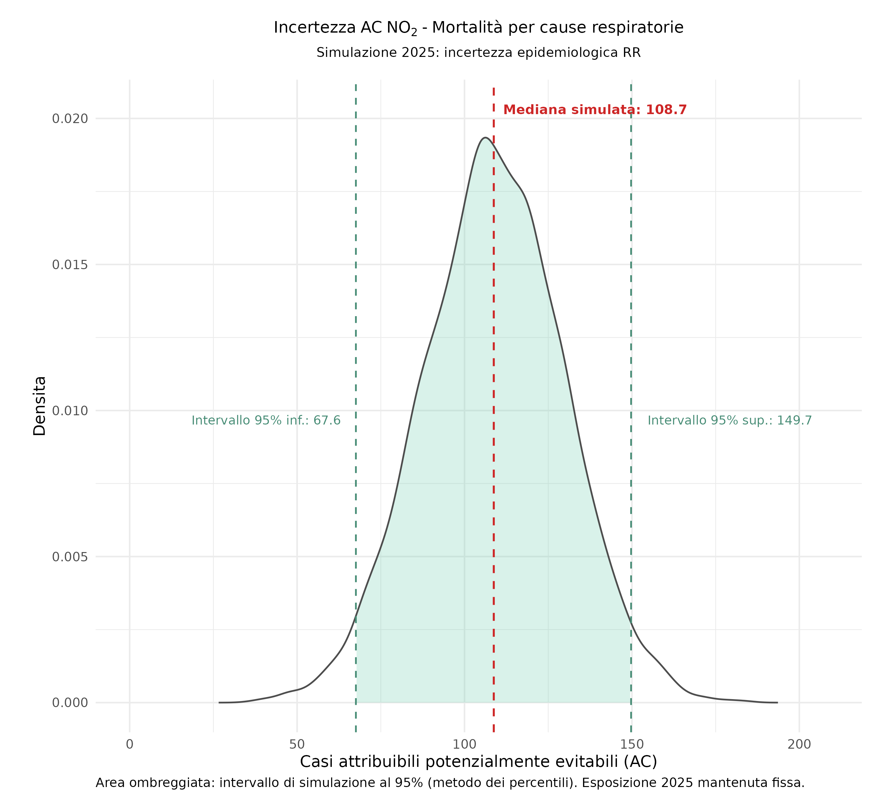
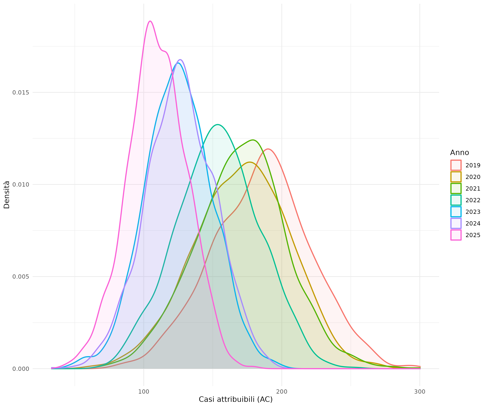

```{r}
#| label: setup
#| include: false

# ---- Caricamento delle librerie ----
library(tidyverse)
library(knitr)
#library(magick)

```

\vfill

\begin{footnotesize}

\textbf{Ringraziamenti e finanziamenti}

La frequenza del Master in \textit{"Biostatistica per la Ricerca Clinica e la Pubblicazione Scientifica (BRCPS 2026)"}, organizzato dall'\textit{Unità di Biostatistica, Epidemiologia e Sanità Pubblica (UBEP)}, presso l'\textit{Università degli Studi di Padova}, è stata resa possibile grazie al finanziamento del \textit{Ministero della Salute}, nell'ambito dei fondi complementari al PNRR, con il progetto PNC PREV-A-2022-12376981: \textit{"Aria outdoor e salute: un atlante integrato a supporto delle decisioni e della ricerca"}.

\end{footnotesize}

\newpage

*Valutazione di impatto sanitario dell’inquinamento atmosferico da $NO_2$: scenario controfattuale ed analisi dell’incertezza. Il caso della Regione Veneto.*


## Sommario {.unnumbered .unlisted}

L'inquinamento atmosferico da biossido di azoto ($NO_2$) è associato in letteratura a effetti sulla mortalità respiratoria. Il presente *project-work* ne stima l'impatto nella Regione Veneto mediante una valutazione controfattuale riferita alla popolazione di età pari o superiore a 30 anni. La funzione concentrazione-risposta OMS/HRAPIE-2 ($RR_{10}=1{.}05$; IC 95%: 1,03–1,07) è stata applicata alla popolazione delle sezioni censuarie ISTAT, utilizzando concentrazioni modellate su griglia di 4 km e tassi grezzi provinciali di mortalità respiratoria nella popolazione 30+. Il differenziale rispetto al livello guida OMS di $10\ \mu g\,m^{-3}$ è stato calcolato per ciascuna sezione prima dell'aggregazione regionale. Per il 2025 si stimano 109 casi attribuibili/anno, pari al 2,86% dei decessi respiratori attesi; la simulazione Monte Carlo che propaga esclusivamente l'incertezza del $RR$ restituisce una mediana di 108,7 casi/anno (IC 95%: 67,6–149,7). Una seconda simulazione, basata sugli scenari di esposizione 2019–2025, produce una mediana di 145,8 casi/anno e un intervallo di simulazione al 95% di 81,5–230,5, fornendo un'analisi descrittiva della sensibilità alla scelta dell'anno di esposizione. L'uso di tassi grezzi provinciali, reso necessario dall'indisponibilità attuale di tassi età-specifici coerenti con il disegno dello studio, costituisce una rilevante fonte di incertezza non propagata.

\newpage

*Health impact assessment of ambient $NO_2$ pollution: counterfactual scenario and uncertainty analysis. A case study of the Veneto Region.*

## Abstract {.unnumbered .unlisted}


Ambient nitrogen dioxide ($NO_2$) pollution has been associated in the literature with respiratory mortality. This *project-work* estimates its impact in the Veneto Region through a counterfactual health impact assessment of the population aged 30 years or older. The WHO/HRAPIE-2 concentration–response function ($RR_{10}=1.05$; 95% CI: 1.03–1.07) was applied to ISTAT census-section populations, using concentrations modelled on a 4-km grid and crude provincial respiratory-mortality rates for the population aged 30+. The exposure contrast relative to the WHO guideline level of $10\ \mu g\,m^{-3}$ was computed for each census section before regional aggregation. For 2025, the estimated impact was 109 attributable cases/year, corresponding to 2.86% of expected respiratory deaths; a Monte Carlo simulation propagating only uncertainty in the $RR$ yielded a median of 108.7 cases/year (95% CI: 67.6–149.7). A second simulation based on the 2019–2025 exposure scenarios yielded a median of 145.8 cases/year and a 95% simulation interval of 81.5–230.5, providing a descriptive sensitivity analysis to the choice of exposure year. The use of crude provincial rates, necessitated by the current unavailability of age-specific rates consistent with the study design, remains an important source of unpropagated uncertainty.


\newpage

## Introduzione

L'inquinamento atmosferico è uno dei principali fattori di rischio ambientale (non individuale) per la salute umana a livello globale. Secondo le stime aggiornate dell'*Organizzazione Mondiale della Sanità (OMS)*, l'esposizione all'inquinamento atmosferico in aria ambiente (*ambient air pollution*) causa ogni anno circa *4 milioni di decessi prematuri* nel mondo, imputabili principalmente a patologie cardiovascolari, respiratorie ed oncologiche [@who_aq:2021].

A livello europeo, nonostante il miglioramento della qualità dell'aria osservato negli ultimi decenni, l'esposizione *outdoor* all'inquinamento atmosferico rimane una criticità rilevante. Le pubblicazioni dell'*Agenzia Europea per l'Ambiente* [@eea_aq:2023] e, a livello regionale, dell'*Agenzia Regionale per la Prevenzione e Protezione Ambientale del Veneto* [@arpav-qa-regione:2026] evidenziano come la Pianura Padana, e in particolare la Regione Veneto, costituisca un'area vulnerabile, caratterizzata da elevata densità abitativa, intensa industrializzazione e condizioni meteoclimatiche che favoriscono l'accumulo degli inquinanti emessi dai diversi settori produttivi.

Il *biossido di azoto* ($NO_2$), prodotto in prevalenza dai processi di combustione ad alta temperatura — tra cui traffico veicolare, riscaldamento e attività produttive — è stato incluso dal progetto *HRAPIE-2* tra le esposizioni per le quali è raccomandata la quantificazione dell'impatto sulla mortalità respiratoria a lungo termine [@hrapie-2:2025; @kasdagli:2024]. L'esito considerato comprende le *malattie del sistema respiratorio* classificate con i codici ICD-10 J00–J99 [@who2019icd10].

## Obiettivi

Lo studio propone una valutazione di impatto sanitario (VIS) basata su uno scenario controfattuale, finalizzata a stimare il numero di decessi per cause respiratorie attribuibili all'esposizione a lungo termine ai livelli ambientali di $NO_2$. La funzione concentrazione-risposta desunta dalla letteratura [@hrapie-2:2025] è applicata alla popolazione di età pari o superiore a 30 anni residente nelle sezioni censuarie della Regione Veneto (ISTAT 2021).

In assenza di dati individuali georeferenziati, non accessibili per ragioni di tutela della riservatezza, le *sezioni censuarie ISTAT* rappresentano la più fine unità demografica disponibile. Il loro impiego preserva una parte dell'eterogeneità territoriale che sarebbe persa con aggregazioni comunali o provinciali, ma non controlla di per sé i confondenti individuali o contestuali. I risultati devono pertanto essere interpretati a livello di popolazione e territorio, evitando inferenze dirette sul rischio individuale (*ecological fallacy*).

L'obiettivo secondario dello studio è delineare un possibile percorso di sviluppo metodologico per stimare in modo robusto il numero di *casi attribuibili* associati all'inquinamento atmosferico e riconducibili a specifici scenari controfattuali in Regione Veneto. 

In prospettiva futura i risultati potranno rappresentare la base conoscitiva per definire uno strumento operativo di analisi quantitativa e di supporto decisionale alla programmazione ed alla valutazione delle Politiche Regionali in materia di Ambiente e Sanità Pubblica.

## Materiali e metodi {#sec-methods}

*Unità statistica di analisi e disegno dello studio*

L'unità statistica di analisi è rappresentata dalla sezione censuaria ISTAT definita come la minima unità territoriale di analisi aggregata della popolazione (43.447 sezioni in Regione Veneto da censimento ISTAT 2021). 

Si tratta di uno studio *ecologico* su base territoriale nel quale esposizione atmosferica, popolazione residente e mortalità basale sono attribuite alla sezione censuaria. L'impiego di questa unità consente di conservare la massima granularità demografica disponibile prima dell'aggregazione dei risultati. Non aumenta, tuttavia, la risoluzione originaria delle concentrazioni modellate — pari a 4 km — né elimina l'errore di classificazione dell'esposizione o il confondimento ecologico.

*Dataset e test statistici*

Il tasso di mortalità basale per *cause respiratorie* (ICD-10 J00–J99) è stato ricavato dai dati ISTAT 2024 disponibili a livello provinciale per la popolazione di età pari o superiore a 30 anni. Si tratta di un tasso grezzo all'interno dell'ampia classe 30+: è specifico per causa, territorio provinciale e popolazione target, ma non è stratificato per classi d'età più ristrette.

Il *cutoff* alla classe d'età 30+ individua la popolazione adulta alla quale si riferisce la funzione concentrazione-risposta adottata [@hrapie-2:2025].

Idealmente, i decessi attesi nella sezione $i$ dovrebbero essere calcolati per classi d'età $a$, applicando alla popolazione sezionale i corrispondenti tassi provinciali età-specifici:

$$
E_i=\sum_a N_{ia}\,B_{p(i),a},
$$

dove $N_{ia}$ è la popolazione della sezione $i$ nella classe d'età $a$ e $B_{p(i),a}$ è il tasso di mortalità respiratoria della medesima classe nella provincia $p(i)$. Questa formulazione terrebbe conto della forte dipendenza della mortalità respiratoria dall'età e delle differenze nella composizione demografica tra sezioni.

Nell'assetto informativo attualmente disponibile per lo studio non è, tuttavia, presente una serie completa di tassi provinciali di mortalità respiratoria età-specifici, coerente per definizione dell'esito, classi d'età, periodo di riferimento e popolazione utilizzata per il calcolo dei tassi. Non è stato quindi possibile applicare una standardizzazione indiretta correttamente allineata ai dati di popolazione sezionale. La scelta non dipende dalla scarsa numerosità dei decessi osservati nelle singole sezioni: una standardizzazione indiretta impiegherebbe infatti tassi esterni e non richiederebbe di stimare tassi sezionali instabili.

È stata pertanto adottata la seguente approssimazione:

$$
E_i=N_{i,30+}\,B_{p(i),30+},
$$

attribuendo a ogni sezione il tasso grezzo 30+ della provincia di appartenenza. Questa soluzione conserva le differenze provinciali del rischio basale, assicura coerenza tra numeratore, denominatore e definizione dell'esito ed evita di stimare direttamente tassi da conteggi sezionali sparsi. Essa presuppone però che, all'interno di ciascuna provincia, il tasso grezzo 30+ sia trasportabile alle singole sezioni. In particolare, non rappresenta le differenze locali nella struttura per età e negli altri determinanti della mortalità basale: a parità di numerosità della popolazione 30+, i decessi attesi potrebbero essere sottostimati nelle sezioni relativamente più anziane e sovrastimati in quelle relativamente più giovani.

I tassi provinciali di mortalità per cause respiratorie variano dallo 0,084% allo 0,140%; il tasso grezzo regionale implicito è pari a circa 0,107%, ossia 107 decessi ogni 100.000 residenti di età pari o superiore a 30 anni.

I *casi attesi* non sono conteggi osservati nelle sezioni, ma valori modellati ottenuti combinando la popolazione 30+ del censimento 2021 con i tassi provinciali 2024. Il disallineamento temporale tra popolazione, tassi basali ed esposizione 2025 rende la stima una valutazione sintetica standardizzata sulla popolazione disponibile, condizionata all'ipotesi che tali componenti siano sufficientemente compatibili nel breve periodo. La conseguente incertezza non è inclusa nella simulazione corrente.

La concentrazione media annuale di biossido di azoto ($NO_2$) attribuita alle singole sezioni censuarie è stata ottenuta mediante un *overlay* geografico tra i poligoni censuari e il grigliato di output del modello euleriano di dispersione atmosferica *CAMx*, calcolando una media zonale pesata per la superficie di intersezione.
Il modello *CAMx*, distribuito da *Ramboll Environ* (http://www.camx.com/), è lo strumento operativo della catena modellistica SPIAIR implementata da ARPAV per la stima degli inquinanti atmosferici in Regione Veneto, su un grigliato regolare di output che ha una risoluzione orizzontale di 4 km. 

Le variabili demografiche aggregate per sezione censuaria — popolazione totale residente e popolazione di età pari o superiore a 30 anni — sono state ricavate dalla rielaborazione dei dati ISTAT 2021 *Basi territoriali e variabili censuarie* (https://www.istat.it/notizia/basi-territoriali-e-variabili-censuarie/).

*Valutazione di impatto sanitario (VIS)*

L'impatto sanitario è stato valutato impiegando il rischio relativo desunto dalla letteratura OMS/HRAPIE-2 per la mortalità respiratoria (ICD-10 J00–J99) nella popolazione 30+: $RR_{10}=1{.}05$ (IC 95%: 1,03–1,07) per ogni incremento di $10\ \mu g\,m^{-3}$ [@hrapie-2:2025]. L'applicazione locale presuppone la trasportabilità di questa funzione concentrazione-risposta alla popolazione delle sezioni censuarie della Regione Veneto.

Per quantificare l'impatto sanitario associato al differenziale tra esposizione modellata e scenario controfattuale è stata applicata, in ogni sezione censuaria, la funzione concentrazione-risposta utilizzata nel software *WHO AirQ+* [@who_airq:2020].

I *casi attribuibili* rappresentano la quota dei decessi attesi associata all'esposizione eccedente il livello controfattuale e sono interpretabili come casi potenzialmente evitabili se tale differenziale fosse annullato, subordinatamente alle assunzioni del modello. Per la sezione censuaria $i$:

$$
C_{i,\mathrm{cf}}=\min(C_{i,\mathrm{obs}},C_{\mathrm{ref}}),
\qquad
\Delta C_i=C_{i,\mathrm{obs}}-C_{i,\mathrm{cf}}
=\max(C_{i,\mathrm{obs}}-C_{\mathrm{ref}},0),
$$

$$
AF_i=\frac{RR_i-1}{RR_i}=1-e^{-\beta\Delta C_i},
\qquad
AC_i=E_i\,AF_i=N_iB_i\left(1-e^{-\beta\Delta C_i}\right).
$$

Le quantità regionali sono ottenute soltanto dopo il calcolo sezionale:

$$
AC_{\mathrm{Reg}}=\sum_i AC_i,
\qquad
AF_{\mathrm{Reg}}=\frac{\sum_i AC_i}{\sum_i E_i}.
$$

dove:

- $C_{i,\mathrm{obs}}$: la concentrazione media annuale modellata nella sezione $i$;

- $C_{\mathrm{ref}}=10\ \mu g\,m^{-3}$: la concentrazione controfattuale di riferimento;

- $RR_i=e^{\beta\Delta C_i}$: il *rischio relativo* associato al differenziale di concentrazione della sezione $i$;

- $\beta = \frac{\ln(RR_{10})}{10}$: il coefficiente della funzione log-lineare di concentrazione-risposta scalato su un incremento base di $10 \ \mu g/m^3$;

- $N_i$: la popolazione target di riferimento nella sezione $i$ (popolazione 30+);

- $B_i$: il tasso basale grezzo di mortalità respiratoria della provincia alla quale appartiene la sezione $i$;

- $E_i=N_iB_i$: il numero modellato di decessi respiratori attesi nella sezione $i$.

Il livello guida OMS di $10\ \mu g\,m^{-3}$ [@who_aq:2021] è qui utilizzato come concentrazione controfattuale di riferimento, non come soglia biologica al di sotto della quale il rischio sia necessariamente nullo. Nelle sezioni con concentrazioni inferiori o uguali al riferimento, lo scenario controfattuale coincide con la concentrazione modellata e $\Delta C_i=0$; in questo modo non si attribuisce un effetto protettivo artificiale a concentrazioni già inferiori al valore di confronto.

La *frazione attribuibile* $AF$ è il rapporto tra casi attribuibili e casi attesi annui e rappresenta la quota di mortalità potenzialmente evitabile attraverso l’azzeramento del differenziale di esposizione controfattuale. In altri termini, $AF$ rappresenta la quota di casi stimata come attribuibile all’esposizione eccedente il livello controfattuale, subordinatamente alla validità della funzione concentrazione-risposta e alle assunzioni del modello.

La frazione $({RR_i-1})/{RR_i}$ esprime la proporzione dei casi attesi associata al differenziale considerato. Non rappresenta una quota osservata né dimostra un nesso causale locale: la sua interpretazione dipende dalla validità e dalla trasportabilità della funzione concentrazione-risposta.

La concavità della funzione di impatto implica che, a parità di pesi e dopo avere definito i differenziali non negativi $\Delta C_i$, applicare la funzione al differenziale medio può produrre una stima maggiore di quella ottenuta applicandola separatamente alle unità e aggregando i risultati [^nota]. Questa proprietà non autorizza una conclusione universale sulla direzione dell'errore per qualunque forma di aggregazione, soprattutto quando cambiano i pesi o la concentrazione media attraversa il valore di riferimento.

Per preservare l'eterogeneità demografica e ambientale disponibile, il differenziale $\Delta C_i$ e i casi attribuibili $AC_i$ sono quindi calcolati separatamente per ciascuna sezione censuaria e aggregati solo successivamente. La sezione costituisce la più fine unità demografica accessibile; la risoluzione effettiva dell'esposizione resta quella del modello ambientale.

[^nota]: Si rimanda al testo riportato in Appendice per una dimostrazione rigorosa.

*Scenari di valutazione controfattuale*

La valutazione confronta, per ciascuna sezione censuaria, due livelli di esposizione:

- *scenario 2025* ($C_{i,\mathrm{obs}}$), rappresentato dalla concentrazione media annuale modellata per il 2025;

- *scenario controfattuale* ($C_{i,\mathrm{cf}}$), pari a $10\ \mu g\,m^{-3}$ nelle sezioni al di sopra del livello guida e uguale alla concentrazione modellata nelle sezioni che già si collocano al di sotto o in corrispondenza di tale valore.

Il differenziale $\Delta C_i$ rappresenta pertanto la riduzione necessaria per ricondurre al livello guida OMS le sole sezioni che lo superano. Lo scenario è normativo e comparativo: non implica l'assenza di effetti sanitari al di sotto di $10\ \mu g\,m^{-3}$.

*Analisi probabilistiche dell’incertezza e della variabilità temporale*

Al fine di distinguere l’incertezza epidemiologica dalla variabilità temporale dell’esposizione, sono state condotte due simulazioni Monte Carlo separate. Nel presente studio, ciascuna simulazione Monte Carlo ripete il calcolo dell’impatto per $B=10\ 000$ repliche,  estraendo a ogni iterazione i parametri o gli scenari secondo le distribuzioni di probabilità specificate, così da ottenere una distribuzione dei risultati anziché una sola stima puntuale.

Nella prima simulazione, riferita specificamente al 2025, le concentrazioni modellate, la popolazione e i tassi di mortalità sono stati mantenuti fissi. A ogni iterazione è stato estratto un unico valore di $RR_{10}$, comune a tutte le sezioni censuarie, assumendo:

$$
\log(RR_{10})\sim\mathcal{N}\!\left[
\log(1{.}05),\,\sigma_{\log RR}^{2}
\right],
\qquad
\sigma_{\log RR}
=
\frac{\log(1{.}07)-\log(1{.}03)}
{2\times1{.}96}.
$$

La distribuzione Monte Carlo così ottenuta propaga esclusivamente l’incertezza epidemiologica associata al $RR_{10}$. I percentili 2,5 e 97,5 possono pertanto essere interpretati come limiti di un IC 95%  dell’impatto, ottenuto propagando l’incertezza del rischio relativo e condizionato agli altri input del modello, trattati come noti.

Nella seconda simulazione, finalizzata a descrivere la variabilità storica del carico sanitario, a ogni iterazione è stato selezionato con uguale probabilità uno dei sette scenari annuali di esposizione compresi tra il 2019 e il 2025. Il campo spaziale delle concentrazioni relativo all’anno selezionato è stato applicato simultaneamente a tutte le sezioni censuarie, preservandone la configurazione spaziale modellata. Nella
stessa iterazione è stato inoltre estratto un valore di $RR_{10}$ dalla medesima distribuzione lognormale. La popolazione e i tassi basali sono fissi.

I percentili della distribuzione risultante definiscono un *intervallo di simulazione* riferito alla combinazione tra variabilità storica dell’esposizione e incertezza epidemiologica del rischio relativo. Tale
intervallo non costituisce un IC della stima specifica per il 2025 né una previsione del carico sanitario futuro.

*Software*

Le analisi statistiche sono state effettuate in ambiente di programmazione *R (v. 4.5+)* [@R_manual:2022], con l'impiego dei pacchetti `tidyverse` e `viridis` per la gestione e la rappresentazione dei dati e di `sf` e `terra` per l'analisi dei dati georeferenziati.

Questo documento è stato redatto dinamicamente con *Quarto* (https://quarto.org/), sistema *open source* di pubblicazione scientifica per la trasparenza e la riproducibilità (*reproducible research*).

\newpage

## Risultati

Secondo il censimento ISTAT 2021, la Regione Veneto (@fig-map-sez21) è costituita da `r format(43447, big.mark = " ")` sezioni censuarie abitate che rappresentano un totale di `r format(4847745, big.mark = " ")` residenti. 

Le sezioni censuarie del Veneto coprono una superficie di `r format(14511, big.mark = " ")` $km^2$, con una densità media di 334 $ab\,km^{-2}$. La sezione censuaria *mediana* ha un'estensione pari a circa 2,90 $ha$, con una densità abitativa mediana pari a 13,5 $ab\,ha^{-1}$.

La popolazione in classe d'età 30+ è costituita da `r format(3521995, big.mark = " ")` abitanti, che rappresentano circa il 73% della popolazione totale. 

```{r}
#| label: fig-map-sez21
#| fig-cap: "Sezioni censuarie Regione Veneto (ISTAT 2021)."
#| fig-align: "center"
#| out-height: "0.4\\textheight"
#| out-width: "!\\textheight"
#| echo: false
#| fig-pos: "H"
#| 
knitr::include_graphics("./fig_tab/map_sezioni_censuarie_rv.png")

```

L'impiego della sezione censuaria come unità demografica consente di rappresentare gruppi di popolazione mediamente contenuti [^nota-ha]. Tuttavia, l'asimmetria e la multimodalità della loro distribuzione impongono cautela: dimensione, densità ed estensione delle sezioni sono molto eterogenee e la risoluzione ambientale effettiva rimane pari a 4 km.

[^nota-ha]: L'estensione della sezione *mediana* copre una superficie equivalente ad un quadrato di lato circa 170 m. 

In @fig-map-pop30p è rappresentata la distribuzione spaziale della popolazione 30+ residente nelle sezioni censuarie del Veneto nel 2021. La quasi totalità delle sezioni abitate comprende residenti appartenenti alla popolazione target: soltanto 111 sezioni, pari a circa lo 0,25% del totale, non presentano residenti di età pari o superiore a 30 anni.

```{r}
#| label: fig-map-pop30p
#| fig-cap: "Popolazione classe 30+ sezioni censuarie Regione Veneto  (ISTAT 2021)."
#| fig-align: "center"
#| out-height: "0.45\\textheight"
#| out-width: "!\\textheight"
#| echo: false
#| fig-pos: "H"

knitr::include_graphics("./fig_tab/map_sez_pop30p.png")

```

La @fig-map-attesi rappresenta il numero modellato di decessi respiratori attesi ogni anno, ottenuto applicando alla popolazione sezionale 30+ del 2021 il tasso grezzo 30+ della provincia di appartenenza riferito al 2024. La somiglianza con la distribuzione della popolazione in @fig-map-pop30p è quindi attesa. Le differenze tra province riflettono anche i diversi tassi basali; quelle entro la stessa provincia dipendono essenzialmente dalla numerosità della popolazione target, poiché a tutte le sezioni provinciali è attribuito il medesimo tasso.

Questa rappresentazione non descrive decessi effettivamente osservati nelle singole sezioni. In assenza di tassi età-specifici coerenti, eventuali differenze locali nella composizione per età non sono identificate: la mappa va quindi letta come distribuzione del denominatore sanitario modellato utilizzato dalla VIS, non come mappa del rischio respiratorio sezionale.

```{r}
#| label: fig-map-attesi
#| fig-cap: "Casi attesi/anno per cause respiratorie nelle  sezioni censuarie Regione Veneto."
#| fig-align: "center"
#| out-height: "0.45\\textheight"
#| out-width: "!\\textheight"
#| echo: false
#| fig-pos: "H"
#| 
knitr::include_graphics("./fig_tab/map_sezioni_attesi.png")

```

La @fig-map-no2-2025 rappresenta la distribuzione spaziale della concentrazione media annuale di $NO_2$ nella Regione Veneto relativa all'anno 2025 ottenuta su grigliato regolare e risoluzione orizzontale di 4 km, tramite la catena modellistica SPIAIR. Il 2025 è l'anno più recente per cui sono disponibili stime modellistiche e rappresenta il determinante ambientale rispetto al quale viene effettuata la valutazione di impatto sanitario sulla popolazione residente (attesi) in classe d'età 30+. 

La distribuzione spaziale delle concentrazioni ambientali di $NO_2$ relative all'anno 2025 assegnate a ciascuna sezione censuaria è rappresentata in @fig-map-sez-no2-2025. 
La mappa rappresenta il livello di esposizione alle concentrazioni ambientali di $NO_2$ nell'anno 2025 per la popolazione in classe d'età 30+ residente in ciascuna sezione censuaria.

Per la Regione Veneto la popolazione delle sezioni censuarie risulta esposta ad una concentrazione *media pesata* di $NO_2$ pari a $16\ \mu g~m^{-3}$, mentre il valore medio pesato a livello provinciale è compreso entro l'intervallo tra circa $7\ \mu g~m^{-3}$, per la Provincia di Belluno, e circa $18\ \mu g~m^{-3}$, per le Province di Padova e Venezia.

Per confrontare le concentrazioni modellate con la serie storica dal 2019 si rimanda al *boxplot* in @fig-no2-boxplot-prov, nel quale è indicato anche il livello guida OMS di $10\ \mu g\,m^{-3}$ adottato come riferimento controfattuale.

Per contestualizzare l'esposizione della popolazione 30+, la @fig-exp-pop_prov riporta le curve cumulative della quota di popolazione associata ai diversi livelli di concentrazione, stratificate per provincia e riferite al 2019 e al 2025. Il confronto descrittivo evidenzia una riduzione dell'esposizione nel 2025 e mostra la distanza residua dal livello controfattuale di $10\ \mu g\,m^{-3}$.

Per un inquadramento della serie storica delle concentrazioni modellate nel periodo 2019–2025 e una valutazione esplorativa del trend annuale aggregato a livello comunale si rimanda all'Appendice (@fig-map-no2-ts e @fig-map-mk-sen).

\newpage

```{r}
#| label: fig-map-no2-2025
#| fig-cap: "Concentrazione media annuale $NO_2$ (2025) da modellistica Regione Veneto."
#| fig-align: "center"
#| out-height: "0.40\\textheight"
#| out-width: "!\\textheight"
#| echo: false
#| fig-pos: "H"
#| 
knitr::include_graphics("./fig_tab/map_no2_2025.png")

```

\vspace{-0.5em}
\nopagebreak

```{r}
#| label: fig-map-sez-no2-2025
#| fig-cap: "Concentrazione media $NO_2$ (2025) per sezioni censuarie Regione Veneto."
#| fig-align: "center"
#| out-height: "0.40\\textheight"
#| out-width: "!\\textheight"
#| echo: false
#| fig-pos: "H"
#| 
knitr::include_graphics("./fig_tab/map_sezioni_no2_2025.png")

```

\newpage

```{r}
#| label: fig-no2-boxplot-prov
#| fig-cap: "Boxplot concentrazioni $NO_2$ (2025) per sezioni censuarie Regione Veneto."
#| fig-align: "center"
#| out-height: "0.42\\textheight"
#| out-width: "!\\textheight"
#| echo: false
#| fig-pos: "H"

knitr::include_graphics("./fig_tab/no2_boxplot_no2_provincia.png")

```

\vspace{-0.5em}
\nopagebreak

```{r}
#| label: fig-exp-pop_prov
#| fig-cap: "Esposizione cumulata popolazione ai livelli ambientali $NO_2$ nel 2019 e 2025."
#| fig-align: "center"
#| out-height: "0.43\\textheight"
#| out-width: "!\\textheight"
#| echo: false
#| fig-pos: "H"

knitr::include_graphics("./fig_tab/no2_exp_pop_2019_2025_by_province.png")

```

\newpage

Nel 2025 il differenziale non negativo tra la concentrazione modellata e il riferimento controfattuale di $10\ \mu g\,m^{-3}$ è risultato in media pari a $5{.}7\ \mu g\,m^{-3}$, con una mediana di $5{.}9\ \mu g\,m^{-3}$ e un intervallo interquartile di $3{.}9\ \mu g\,m^{-3}$.

Il differenziale mostra una marcata eterogeneità descrittiva tra province (@tbl-diff-prov).

| Provincia | Media    | Mediana    | Min     | Max     | IQR     |
|:----------|---------:|-----------:|--------:|--------:|--------:|
| Belluno   |      0.2 |        0.0 |     0.0 |     1.2 |     0.3 |
| Padova    |      7.2 |        7.6 |     2.4 |     9.9 |     2.8 |
| Rovigo    |      4.0 |        3.8 |     1.8 |     6.1 |     1.0 |
| Treviso   |      6.0 |        6.0 |     0.0 |    10.7 |     2.9 |
| Venezia   |      8.1 |        8.7 |     3.4 |    11.1 |     3.2 |
| Verona    |      4.7 |        5.0 |     0.0 |     8.1 |     1.9 |
| Vicenza   |      5.2 |        5.5 |     0.0 |     9.7 |     3.9 |

: Statistiche descrittive, stratificate per Provincia, del differenziale di esposizione tra il livello ambientale di $NO_2$ ($\mu g~m^{-3}$) ed il valore guida OMS ($10\ \mu g~m^{-3}$). {#tbl-diff-prov}

La @fig-map-sez-delta-no2 rappresenta la distribuzione spaziale del differenziale tra la concentrazione modellata nel 2025 e il livello controfattuale di $10\ \mu g\,m^{-3}$.

La stima di impatto sanitario per ciascuna sezione è basata su tale differenziale mediante la funzione concentrazione-risposta definita in @sec-methods e discussa nell'Appendice.

```{r}
#| label: fig-map-sez-delta-no2
#| fig-cap: "Differenziale di concentrazione ambientale $NO_2$ per anno 2025."
#| fig-align: "center"
#| out-height: "0.4\\textheight"
#| out-width: "!\\textheight"
#| echo: false
#| fig-pos: "H"


knitr::include_graphics("./fig_tab/map_sezioni_delta_no2_2025_target_oms.png")

```

Per il 2025 si stimano complessivamente *109 decessi attribuibili/anno per cause respiratorie nella popolazione di età pari o superiore a 30 anni*. Con il valore centrale $RR_{10}=1{.}05$, la frazione attribuibile regionale è pari al 2,86% dei decessi attesi. Applicando separatamente gli estremi dell'IC del $RR$ (1,03–1,07), il carico varia deterministicamente da 66,3 casi/anno ($AF_{\mathrm{low}}=1{.}74\%$) a 150,0 casi/anno ($AF_{\mathrm{upp}}=3{.}95\%$).

La @fig-map-sez-af riporta la frazione attribuibile nelle sezioni censuarie, cioè la quota modellata di decessi respiratori attesi associata al differenziale rispetto al riferimento OMS.

```{r}
#| label: fig-map-sez-af
#| fig-cap: "Frazione attribuibile (AF) nelle sezioni della Regione Veneto (anno 2025)."
#| fig-align: "center"
#| out-height: "0.4\\textheight"
#| out-width: "!\\textheight"
#| echo: false
#| fig-pos: "H"


knitr::include_graphics("./fig_tab/map_AF_sezioni_no2_2025.png")

```


Nella @tbl-ac-prov viene riportato per l'anno 2025 il dettaglio stratificato per Provincia del numero di casi attesi (dato di stima demografica), del valore centrale ($\text{AC}$), degli estremi inferiore ($\text{AC}_{\text{low}}$) e superiore ($\text{AC}_{\text{upp}}$) dei casi attribuibili e della frazione attribuibile ($\text{AF}$).


| Provincia | Attesi | AC | AF | $AC_{low}$ | $AC_{upp}$ |
| :--- | ---: | ---: | ---: | ---: | ---: |
| Belluno | 209 | 0.21 | 0.0010 | 0.13 | 0.29 |
| Padova | 766 | 27.10 | 0.0354 | 16.50 | 37.30 |
| Rovigo | 148 | 2.84 | 0.0192 | 1.73 | 3.92 |
| Treviso | 587 | 17.40 | 0.0297 | 10.60 | 24.00 |
| Venezia | 626 | 23.90 | 0.0381 | 14.60 | 32.80 |
| Verona | 797 | 19.50 | 0.0245 | 11.90 | 26.90 |
| Vicenza | 668 | 17.70 | 0.0265 | 10.80 | 24.40 |

: Stima del numero di casi attribuibili/anno (AC), frazione attribuibile (AF) stratificati per Provincia (anno 2025). {#tbl-ac-prov}

Gli estremi $AC_{\mathrm{low}}$ e $AC_{\mathrm{upp}}$ riportati nella @tbl-ac-prov sono valori deterministici ottenuti applicando rispettivamente il limite inferiore e quello superiore dell'IC 95% del $RR$ (1,03–1,07); non sono intervalli stimati separatamente per ciascuna provincia.

La stima puntuale riferita al 2025, ottenuta applicando il valore centrale del rischio relativo ($RR_{10}=1{.}05$), è stata confrontata con una simulazione Monte Carlo nella quale il $RR$ è stato estratto da una distribuzione lognormale parametrizzata sulla stima centrale e sul relativo intervallo di confidenza al 95%. Poiché le concentrazioni modellate per il 2025, la popolazione e i tassi di mortalità basale sono mantenuti fissi, la simulazione propaga esclusivamente l'incertezza epidemiologica associata al $RR$. I percentili della distribuzione simulata possono pertanto essere interpretati come un intervallo di confidenza al 95% dei casi attribuibili propagato dal $RR$, condizionato agli altri input del modello, che sono trattati come noti.

La @fig-sim-2025 mostra la distribuzione simulata dei casi attribuibili per il 2025. La mediana è pari a circa 108,7 casi/anno e risulta sostanzialmente coincidente con la stima puntuale deterministica di 109 casi/anno. Il 2,5° e il 97,5° percentile si attestano rispettivamente a circa 67,6 e 149,7 casi/anno e definiscono l'intervallo di confidenza al 95% propagato dall'incertezza epidemiologica del $RR$. Tali valori sono coerenti con gli estremi deterministici ottenuti applicando direttamente alla funzione di impatto il limite inferiore ($RR=1{.}03$) e quello superiore ($RR=1{.}07$), pari rispettivamente a 66,3 e 150,0 casi/anno. Le modeste differenze osservate sono attribuibili all'approssimazione Monte Carlo e agli arrotondamenti numerici.

La corrispondenza tra i due approcci è attesa, poiché la funzione che lega il $RR$ ai casi attribuibili è monotonicamente crescente. Essa costituisce quindi una verifica della coerenza numerica dell'implementazione, ma non rappresenta una validazione indipendente della stima né introduce ulteriori fonti di informazione. Il vantaggio della simulazione consiste nella possibilità di descrivere l'intera distribuzione probabilistica dell'impatto e di estendere in futuro la propagazione dell'incertezza ad altri parametri del modello.

```{r}
#| label: fig-sim-2025
#| fig-cap: "Distribuzione Monte Carlo dei casi attribuibili/anno per mortalità respiratoria nella popolazione 30+ della Regione Veneto nel 2025. Le linee verdi delimitano l'IC 95% propagato dall'incertezza epidemiologica del rischio relativo."
#| fig-align: "center"
#| out-height: "0.7\\textheight"
#| out-width: "!\\textheight"
#| echo: false
#| fig-pos: "H"



```

Separatamente, la variabilità delle esposizioni nel periodo 2019–2025 è stata analizzata mediante una simulazione Monte Carlo con ricampionamento degli scenari annuali. A ogni iterazione è stato selezionato con uguale probabilità uno degli anni compresi tra il 2019 e il 2025, utilizzando simultaneamente per tutte le sezioni censuarie il corrispondente campo spaziale delle concentrazioni di $\mathrm{NO}_2$. È stato inoltre estratto un valore del $RR$ dalla medesima distribuzione lognormale impiegata nella simulazione 2025. La popolazione e i tassi di mortalità sono stati mantenuti fissi, in modo da isolare, a parità di struttura demografica e sanitaria, l'effetto delle differenze tra gli scenari annuali di esposizione.

La simulazione storica risponde pertanto alla seguente domanda: quale sarebbe il carico sanitario attribuibile sulla popolazione di riferimento se il profilo di esposizione ambientale coincidesse con quello di un anno selezionato casualmente tra il 2019 e il 2025, tenendo conto anche dell'incertezza epidemiologica del $RR$?

La @fig-sim-hist mostra che la distribuzione storica presenta una mediana pari a circa 145,8 casi attribuibili/anno e un intervallo di simulazione al 95% compreso tra circa 81,5 e 230,5 casi/anno. Rispetto alla mediana della simulazione specifica per il 2025, il valore centrale della distribuzione storica è superiore di circa 37 casi/anno, corrispondenti a un incremento relativo di circa il 34%. Anche l'intervallo storico risulta più ampio, poiché combina l'incertezza epidemiologica del $RR$ con la variabilità delle concentrazioni di $\mathrm{NO}_2$ tra i diversi anni.

Il valore centrale più elevato della simulazione storica è coerente con la presenza, soprattutto nella prima parte della serie, di concentrazioni mediamente superiori rispetto a quelle modellate per il 2025. Questo risultato non implica che la stima puntuale del 2025 sottostimi il carico sanitario del medesimo anno: indica, piuttosto, che il 2025 rappresenta uno scenario di esposizione relativamente favorevole rispetto a gran parte del periodo 2019–2025.

L'intervallo della simulazione storica non costituisce un intervallo di confidenza della stima 2025, né una previsione del carico sanitario futuro. Esso descrive la distribuzione dell'impatto ottenuta assegnando uguale probabilità agli scenari annuali modellati nel periodo considerato. Poiché la serie comprende soltanto sette anni ed è caratterizzata da un andamento temporale decrescente, la distribuzione deve essere interpretata come un'analisi descrittiva e di sensibilità rispetto alla scelta dell'anno di esposizione, non come la distribuzione di un processo temporale stazionario.

Nel complesso, le due simulazioni forniscono informazioni complementari: la prima quantifica l'incertezza epidemiologica della stima specifica per il 2025, mentre la seconda colloca tale stima nel contesto della variabilità ambientale osservata tra il 2019 e il 2025.


```{r}
#| label: fig-sim-hist
#| fig-cap: "Distribuzione Monte Carlo dei casi attribuibili/anno ottenuta ricampionando gli scenari annuali di esposizione a $NO_2$ del periodo 2019–2025. Le linee verdi delimitano l'intervallo di simulazione al 95%."
#| fig-align: "center"
#| out-height: "0.7\\textheight"
#| out-width: "!\\textheight"
#| echo: false
#| fig-pos: "H"

knitr::include_graphics("./fig_tab/ac_sim_hist.png")

```

La scomposizione della simulazione storica in base all'anno di esposizione
selezionato consente di distinguere più chiaramente la variabilità tra gli
scenari ambientali dalla dispersione dovuta all'incertezza epidemiologica
(@tbl-sim-hist-years e @fig-sim-hist-years).

Le distribuzioni mostrano uno spostamento complessivo verso valori più bassi dei casi attribuibili nel corso del periodo considerato. La mediana passa da 186,8 casi/anno per lo scenario di esposizione 2019 a 108,9 casi/anno per quello del 2025, con una differenza di 77,8 casi, pari a una riduzione del 41,7% rispetto al 2019. L'andamento non è strettamente monotono: gli scenari 2020–2021 e 2023–2024 producono valori molto simili.

| Anno di esposizione | Mediana AC | Intervallo percentile 95% |
|:-------------------:|-----------:|:--------------------------:|
| 2019 | 186,8 | 113,5–255,0 |
| 2020 | 172,5 | 101,5–234,5 |
| 2021 | 170,9 | 105,0–234,0 |
| 2022 | 153,4 | 95,3–211,1 |
| 2023 | 124,8 | 78,7–173,2 |
| 2024 | 126,4 | 78,0–173,8 |
| 2025 | 108,9 | 66,8–150,0 |

: Mediana e intervallo percentile al 95% dei casi attribuibili, condizionati allo scenario annuale di esposizione selezionato. All'interno di ciascun anno, la dispersione deriva dall'incertezza epidemiologica del rischio relativo, mentre popolazione e tassi basali sono mantenuti fissi. {#tbl-sim-hist-years}

```{r}
#| label: fig-sim-hist-years
#| fig-cap: "Distribuzioni dei casi attribuibili condizionate allo scenario annuale di esposizione $NO_2$ selezionato nella simulazione storica. Lo spostamento tra le curve riflette le differenze tra gli scenari di esposizione; la dispersione interna a ciascuna curva deriva dall’incertezza del rischio relativo."
#| fig-align: "center"
#| out-height: "0.5\\textheight"
#| out-width: "!\\textheight"
#| echo: false
#| fig-pos: "H"



```

## Discussione e conclusioni

La valutazione di impatto sanitario quantifica il numero di decessi per cause respiratorie stimati come potenzialmente evitabili nello scenario controfattuale in cui, nelle sezioni censuarie con concentrazioni medie annuali di $\mathrm{NO}_2$ superiori a $10\ \mu g\,m^{-3}$, l'esposizione sia ricondotta al livello guida OMS 2021. Tale valore è assunto come concentrazione controfattuale di riferimento e non deve essere interpretato come una soglia biologica al di sotto della quale il rischio sanitario sia necessariamente nullo.

Per il 2025, la valutazione restituisce una stima puntuale di circa 109 casi attribuibili/anno, corrispondenti al 2,86% dei decessi respiratori attesi nella popolazione di età pari o superiore a 30 anni. La simulazione Monte Carlo, limitata alla propagazione dell'incertezza epidemiologica del $RR$, produce una mediana di 108,7 casi/anno e un IC 95% compreso tra 67,6 e 149,7 casi/anno. La vicinanza tra questi risultati e quelli ottenuti applicando deterministicamente il valore centrale e gli estremi dell'intervallo del $RR$ conferma la coerenza numerica della procedura. L'intervallo deve tuttavia essere interpretato come condizionato alle concentrazioni modellate, alla popolazione e ai tassi di mortalità, che nella simulazione sono considerati privi di incertezza.

La stima dipende linearmente dal numero di decessi attesi e, quindi, dai tassi basali impiegati. L'uso dei tassi grezzi provinciali 30+ è una soluzione coerente con i dati attualmente disponibili e preferibile all'applicazione di un unico tasso regionale, perché conserva una componente della variabilità territoriale. Non equivale tuttavia a un aggiustamento per età. Le differenze provinciali nei casi attesi possono riflettere sia un diverso rischio di mortalità sia una diversa struttura per età; analogamente, l'attribuzione del medesimo tasso a tutte le sezioni di una provincia non coglie l'eterogeneità demografica interna. I confronti territoriali dei conteggi attribuibili devono quindi essere letti congiuntamente alla numerosità della popolazione, al differenziale di esposizione e a questa approssimazione del rischio basale.

L'analisi territoriale evidenzia una marcata eterogeneità del carico sanitario attribuibile. Le province di Padova e Venezia presentano il maggior numero di casi attribuibili, rispettivamente circa 27 e 24 casi/anno, con frazioni attribuibili pari al 3,5% e al 3,8% dei casi attesi. Belluno mostra invece un impatto stimato molto contenuto, con una frazione attribuibile prossima allo 0,1%, coerentemente con i minori differenziali di esposizione rispetto allo scenario controfattuale. Questi risultati indicano che i potenziali benefici sanitari delle politiche di riduzione dell'$\mathrm{NO}_2$ non sarebbero distribuiti uniformemente nel territorio regionale e risulterebbero maggiori nelle aree di pianura caratterizzate da più elevata densità abitativa e pressione antropica.

La simulazione storica restituisce una mediana di 145,8 casi attribuibili/anno e un intervallo di simulazione al 95% pari a 81,5–230,5 casi/anno. Il valore centrale, superiore di circa il 34% rispetto alla simulazione 2025, riflette l'inclusione di scenari annuali caratterizzati da concentrazioni di $\mathrm{NO}_2$ mediamente più elevate. La maggiore ampiezza dell'intervallo storico mostra inoltre che la scelta dell'anno di esposizione contribuisce in misura rilevante alla variabilità della stima di impatto.

La scomposizione per anno chiarisce che l'ampiezza della distribuzione
storica complessiva non deriva soltanto dall'incertezza del $RR$, ma anche
dalla combinazione di distribuzioni annuali centrate su livelli diversi
di inquinamento atmosferico. Il progressivo spostamento verso valori generalmente più bassi tra il 2019 e il 2025 è coerente con la riduzione delle concentrazioni modellate osservata nella serie ambientale. Poiché popolazione e tassi
basali sono mantenuti costanti, tale andamento non descrive l'evoluzione
temporale dei decessi effettivamente osservati, ma la variazione del carico
attribuibile che si otterrebbe applicando i diversi scenari di esposizione
alla stessa popolazione di riferimento. La sovrapposizione degli intervalli
annuali riflette l'incertezza comune associata al $RR$ e non deve essere
interpretata come un test formale delle differenze tra anni.

Le due distribuzioni non rappresentano stime alternative della stessa quantità. La simulazione 2025 quantifica l'incertezza epidemiologica associata al carico stimato per uno specifico anno; la simulazione storica descrive invece la sensibilità dell'impatto alla variabilità degli scenari ambientali osservati nel periodo 2019–2025. Quest'ultima non modifica la stima del 2025 e non costituisce una previsione, ma consente di riconoscere che il 2025 si colloca in una condizione relativamente favorevole rispetto agli anni precedenti.

Nel complesso, i risultati indicano, sotto le assunzioni adottate, che l'esposizione a $\mathrm{NO}_2$ eccedente il livello controfattuale di riferimento è associata a un carico non trascurabile di mortalità respiratoria nella popolazione adulta del Veneto. Tale conclusione deve essere formulata in termini di impatto stimato e non come nuova dimostrazione di una relazione causale locale, poiché la funzione concentrazione-risposta è trasferita dalla letteratura OMS/HRAPIE-2 e non stimata direttamente attraverso i dati epidemiologici regionali.

*Caratteristiche e limitazioni dello studio*

L'interpretazione dei risultati deve considerare alcune limitazioni rilevanti:

- *natura ecologica*: esposizione, popolazione e mortalità sono riferite a unità territoriali aggregate; i risultati riguardano quindi popolazioni e territori e non possono essere trasferiti direttamente al livello individuale;

- *trasportabilità dei parametri*: il $RR$ deriva dalla letteratura internazionale, mentre i tassi di mortalità provinciali sono attribuiti alle sezioni censuarie; entrambe le operazioni presuppongono una trasportabilità che potrebbe non riflettere differenze locali nella struttura demografica, nella suscettibilità e nell'accesso alle cure;

- *mortalità basale e mancato aggiustamento per età*: nell'assetto informativo attuale non sono disponibili tassi provinciali età-specifici di mortalità respiratoria pienamente coerenti, per esito, periodo e articolazione per età, con i dati demografici utilizzati nello studio.
I tassi grezzi 30+ incorporano la composizione per età della provincia e, se trasferiti alle sezioni, possono sovrastimare i decessi attesi nelle aree relativamente più giovani e sottostimarli in quelle più anziane. Tale errore si trasferisce proporzionalmente ai casi attribuibili;

- *allineamento temporale*: popolazione sezionale, tassi di mortalità ed esposizione si riferiscono rispettivamente al 2021, al 2024 e al 2025. La VIS descrive pertanto una popolazione sintetica costruita con le fonti disponibili e assume una sufficiente stabilità nel breve periodo, non il numero osservato di decessi attribuibili nel 2025;

- *risoluzione dell'esposizione*: la disaggregazione demografica avviene a livello di sezione censuaria, ma la risoluzione effettiva dell'esposizione rimane vincolata al grigliato SPIAIR/CAMx di 4 km, che non può rappresentare interamente la variabilità di microscala;

- *singolo inquinante*: l'analisi considera esclusivamente l'$\mathrm{NO}_2$ e non permette di separarne completamente il contributo da quello della miscela di inquinanti atmosferici, in particolare dal $PM_{2.5}$;

- *scenario controfattuale*: i risultati dipendono dalla scelta di $10\ \mu g\,m^{-3}$ come livello di riferimento; scenari alternativi, quali riduzioni percentuali uniformi o differenti valori target, produrrebbero stime diverse;

- *propagazione incompleta dell'incertezza*: nella simulazione 2025 viene considerata soltanto l'incertezza del $RR$. Non sono propagate le incertezze relative alle concentrazioni modellate, ai tassi di mortalità e alla popolazione. L'IC risultante è quindi condizionato a questi input e non rappresenta l'incertezza complessiva della VIS;

- *interpretazione della simulazione storica*: i sette scenari annuali sono selezionati con uguale probabilità nonostante la presenza di un andamento temporale decrescente e di una possibile autocorrelazione. L'intervallo risultante è pertanto descrittivo e non deve essere interpretato come IC della stima 2025 o come previsione degli anni futuri.

*Conclusioni metodologiche e possibili sviluppi futuri*

Il principale contributo metodologico dello studio consiste nell'applicazione della funzione di impatto alla massima granularità demografica disponibile prima dell'aggregazione regionale e nella separazione tra l'incertezza epidemiologica del rischio relativo e la variabilità degli scenari temporali di esposizione. Questa distinzione evita di combinare indiscriminatamente fonti di variabilità con significati differenti, migliora la trasparenza interpretativa dei risultati e rende la procedura replicabile a supporto della programmazione regionale in materia di ambiente e sanità pubblica.

Permangono, tuttavia, alcuni limiti strutturali propri delle analisi ecologiche su base territoriale:

* *confondimento spaziale e collinearità*: le caratteristiche socio-demografiche e territoriali possono essere associate sia all'esposizione sia all'esito sanitario, rendendo difficile isolare il contributo specifico dell'inquinante [@ramsey_ps:2019];

* *Modifiable Areal Unit Problem (MAUP)*: i risultati possono dipendere dalla scala geografica adottata e dalla delimitazione delle unità territoriali; l'aggregazione tende infatti ad appiattire la variabilità locale, mentre i confini amministrativi non coincidono necessariamente con la distribuzione fisica dell'$\mathrm{NO}_2$;

* *dipendenza e spillover spaziale*: le concentrazioni e le caratteristiche delle aree contigue non sono indipendenti. L'attuale valutazione conserva la configurazione spaziale delle esposizioni modellate, ma non rappresenta esplicitamente la dipendenza spaziale nell'errore di esposizione e nelle altre componenti d'incertezza.

Un primo sviluppo dovrebbe riguardare la *specificazione della mortalità basale e la propagazione integrata dell'incertezza*. Quando saranno disponibili tassi provinciali età-specifici coerenti, i decessi attesi dovranno essere calcolati applicando i tassi di ciascuna classe alla corrispondente popolazione sezionale e sommando i contributi. Ciò separerà, almeno in parte, l'effetto della composizione per età dalle differenze territoriali nel rischio basale. Non sarebbe invece metodologicamente giustificato ricostruire tassi età-specifici mancanti mediante una semplice ripartizione del tasso grezzo, perché questa introdurrebbe informazione non osservata e un'apparente precisione.

In attesa di tali dati, una verifica di sensibilità utile consiste nel ricalcolare l'impatto impiegando alternativamente i tassi grezzi provinciali e un unico tasso grezzo regionale. Questo confronto non risolve il confondimento per età, ma consente di quantificare quanto la sola scelta della scala territoriale del tasso basale influenzi la stima regionale e i confronti provinciali.

Oltre al $RR$, potranno essere incluse l'incertezza delle concentrazioni modellate, dei tassi epidemiologici di base e delle stime demografiche sezionali. L'errore delle concentrazioni potrebbe essere caratterizzato confrontando le stime modellistiche con una granularità più fine, da realizzare attraverso tecniche di data fusion con le misure delle stazioni di monitoraggio di qualità dell'aria e propagazione dei residui dotati di struttura spaziale. 

Qualora fossero disponibili, per classi d’età e piccole aree, sia i conteggi dei decessi sia le corrispondenti popolazioni a rischio, i tassi basali potrebbero essere stabilizzati mediante tecniche di *Empirical Bayes Smoothing* [@marshall:1991] oppure mediante modelli gerarchici bayesiani spaziali o spazio-temporali stimati con INLA [@blangiardo_cameletti:2015].

Queste tecniche sarebbero utili per stime locali derivate da dati sparsi, ma non sostituiscono l'indisponibilità delle necessarie informazioni età-specifiche.

Un secondo sviluppo riguarda la *modellazione spaziale e spazio-temporale*. Strutture autoregressive spaziali, quali i modelli CAR/MICAR o Besag–York–Mollié, insieme a indicatori di autocorrelazione come l'$I$ di Moran, permetterebbero di rappresentare la dipendenza di vicinato e la covarianza residua [@blangiardo_cameletti:2015]. Sul piano temporale, la selezione uniforme degli anni potrebbe essere sostituita da un modello che descriva esplicitamente il trend e l'autocorrelazione delle concentrazioni. Ciò consentirebbe di distinguere la variabilità interannuale dal miglioramento strutturale della qualità dell'aria e, sulla base di ipotesi adeguate, di formulare scenari previsivi.

Una terza direttrice è rappresentata dall'*inferenza causale spaziale* (*Spatial Causal Inference*). L'impiego di approcci quali *propensity score*, IPTW o *g-computation*, opportunamente estesi al contesto spaziale [@dominici_cas_evi:2017; @akbari_sp_inf:2023], potrebbe contribuire a controllare i confondenti socio-demografici e territoriali e a distinguere più chiaramente l'effetto attribuibile all'esposizione da quello delle caratteristiche delle popolazioni residenti. La natura aggregata dei dati continuerebbe comunque a richiedere cautela nell'interpretazione causale e impedirebbe un trasferimento automatico dei risultati al livello individuale.

Nel complesso, l'estensione della propagazione dell'incertezza, l'adozione di modelli spaziali e spazio-temporali e l'integrazione di metodi di inferenza causale renderebbero la valutazione più solida e più adatta al supporto quantitativo delle politiche regionali di prevenzione ambientale e sanitaria.


## Bibliografia

::: {#refs}
:::

\newpage

## Appendice {.unnumbered}

**Funzione per la stima dei casi attribuibili**

Questa sezione riprende la nota metodologica richiamata in @sec-methods e illustra le proprietà della funzione utilizzata per stimare la frazione attribuibile e i casi attribuibili.

La funzione di impatto utilizzata nel presente studio e implementata in *AirQ+* è:

$$
f(\Delta C) = 1 - e^{-\beta \cdot \Delta C}.
$$

Calcolando la derivata prima e la derivata seconda della funzione rispetto a $\Delta C$, si ottiene:

$$
f'(\Delta C) = \beta e^{-\beta \cdot \Delta C} > 0,
\qquad
f''(\Delta C) = -\beta^2 e^{-\beta \cdot \Delta C} < 0.
$$

La derivata prima positiva indica che la frazione attribuibile aumenta all'aumentare del differenziale di esposizione; a parità di decessi attesi, aumentano di conseguenza anche i casi attribuibili. La derivata seconda negativa indica che la funzione è strettamente concava: incrementi successivi di uguale ampiezza del differenziale producono aumenti progressivamente più contenuti della frazione attribuibile.

La @fig-f-who riproduce graficamente l'andamento della funzione $f(\Delta C)$ nell'intervallo $\Delta C \in [0, 100] ~\mu g~ m^{-3}$, rendendo visivamente evidenti la monotonia crescente e la concavità appena dimostrate, con la retta tangente nell'origine tracciata come riferimento per apprezzare meglio il progressivo rallentamento dei rendimenti marginali.

```{r}
#| label: fig-f-who
#| echo: false
#| message: false
#| warning: false
#| fig-cap: 'Funzione di stima dell’impatto sanitario in funzione di $\Delta C$'
#| fig-height: 2.5
#| fig-width: 5
#| fig-pos: "H"


# grafico calibrato per RR = 1.05 per 10 µg/m3
# quindi β = ln(1.05)/10 ≈ 0.004879

# Calcolo di beta a partire dall'RR fornito (1.05 per 10 ug/m3)
RR <- 1.05
beta <- log(RR) / 10

# Funzione di impatto sanitario
f <- function(delta_c, beta) 1 - exp(-beta * delta_c)

# Griglia di valori di Delta C
delta_c_seq <- seq(0, 100, by = 0.1)
df <- data.frame(
  delta_c = delta_c_seq,
  f_val = f(delta_c_seq, beta)
)

ggplot(df, aes(x = delta_c, y = f_val)) +
  geom_line(linewidth = 0.8, color = "#2c7fb8") +
  geom_abline(intercept = 0, slope = beta, linetype = "dashed", color = "grey60", linewidth = 0.4) +
  labs(
    x = expression(Delta*C~(mu*g/m^3)),
    y = expression(f(Delta*C) == 1 - e^{-beta*Delta*C}),
    title = "Funzione di stima impatto sanitario",
    subtitle = expression(paste(beta, " = ln(1.05)/10 ", "=", " 0.00488"))
  ) +
  theme_minimal(base_size = 11) +
  theme(
    #plot.title = element_text(face = "bold", size = 12),
    plot.subtitle = element_text(size = 10, color = "grey30")
  )

```

La principale conseguenza metodologica della concavità riguarda il livello territoriale al quale viene applicata la funzione. In base alla *disuguaglianza di Jensen* [@casella2002statistical], per una funzione concava vale:

$$
\mathbb{E}[f(\Delta C)]
\leq
f\left(\mathbb{E}[\Delta C]\right).
$$

In termini applicativi, ciò significa che calcolare la frazione attribuibile separatamente nelle diverse unità territoriali e aggregare successivamente i risultati non equivale ad applicare direttamente la funzione al differenziale medio di esposizione. 

Utilizzando in entrambi i calcoli gli stessi pesi, la frazione attribuibile ottenuta applicando la funzione al differenziale medio ponderato è maggiore o uguale a quella risultante dal calcolo separato per ciascuna sezione e dalla successiva aggregazione.

Nella presente analisi, il differenziale medio rilevante non è una semplice media aritmetica delle sezioni censuarie. Il contributo di ciascuna sezione al risultato regionale è commisurato al numero di decessi attesi, determinato dalla popolazione residente di età pari o superiore a 30 anni e dal tasso basale di mortalità della provincia di appartenenza. Le sezioni con un numero maggiore di decessi attesi incidono pertanto maggiormente sulla frazione attribuibile regionale. 

Ne consegue che l'applicazione della funzione al differenziale medio ponderato, trattando la regione come un'area omogenea, può produrre una stima superiore a quella ottenuta applicando la funzione separatamente alle sezioni e sommando successivamente i casi attribuibili. I due risultati coincidono quando il differenziale di esposizione è costante nelle sezioni che contribuiscono al calcolo.

Questa conclusione riguarda un confronto effettuato utilizzando gli stessi pesi e differenziali di esposizione già definiti rispetto al livello controfattuale e troncati a zero. Non può essere estesa automaticamente a procedure differenti, come il calcolo della concentrazione media prima dell'applicazione del valore controfattuale oppure l'impiego di criteri di ponderazione diversi.

Il calcolo sezionale seguito dall'aggregazione regionale rimane pertanto preferibile, perché conserva l'eterogeneità demografica e ambientale disponibile. La disuguaglianza di Jensen chiarisce una specifica conseguenza della concavità della funzione di impatto, ma non stabilisce una regola universale sulla direzione di ogni possibile distorsione derivante dall'aggregazione territoriale.

Un esempio numerico semplificato consente di visualizzare il meccanismo. Si considerino due sole sezioni censuarie alle quali, esclusivamente a fini illustrativi, viene attribuito lo stesso peso; ciò equivale ad assumere che nelle due sezioni sia atteso lo stesso numero di decessi. Siano $\Delta C_1=2\ \mu g\,m^{-3}$ e $\Delta C_2=18\ \mu g\,m^{-3}$, con differenziale medio pari a $10\ \mu g\,m^{-3}$ e $\beta=0{.}01$. Si ottiene:

$$
f(2)=1-e^{-0{.}02}\approx0{.}0198,
\qquad
f(18)=1-e^{-0{.}18}\approx0{.}1647.
$$

La media dei due valori sezionali della frazione attribuibile è circa $0{.}0923$. Applicando invece la funzione direttamente al differenziale medio si ottiene:

$$
f(10)=1-e^{-0{.}1}\approx0{.}0952.
$$

Il valore calcolato sul differenziale medio risulta quindi, seppure di poco, superiore alla media dei valori calcolati separatamente. Geometricamente, ciò dipende dal fatto che il grafico di una funzione concava si colloca al di sopra della corda che congiunge due suoi punti.

L'esempio considera intenzionalmente pesi uguali per isolare e rendere immediatamente visibile l'effetto della concavità. Non riproduce la ponderazione effettiva dell'analisi regionale, nella quale il contributo delle sezioni varia in funzione dei rispettivi decessi attesi. Nei dati reali, inoltre, il confronto dipende dalla definizione del differenziale, dai pesi utilizzati e dal livello territoriale al quale viene effettuata l'aggregazione.


\newpage

**Serie storica $NO_2$ da modellistica regionale**

In questa sezione dell'Appendice viene proposta un breve inquadramento della serie storica delle concentrazioni ambientali di $NO_2$ in Regione Veneto che sono state stimate per il periodo dal 2019 al 2025 tramite la catena modellistica SPIAIR.

In @fig-map-no2-ts sono riportate le mappe delle concentrazioni medie annuali di $NO_2$. La sequenza mostra una generale riduzione dei valori modellati e i livelli medi più bassi nel 2025; data la brevità della serie, la stabilità del processo non può essere stabilita su questa sola base.

```{r}
#| label: fig-map-no2-ts
#| fig-cap: "Serie storica concentrazioni $NO_2$ dal 2019 al 2025."
#| fig-align: "center"
#| out-height: "0.5\\textheight"
#| out-width: "!\\textheight"
#| echo: false

knitr::include_graphics("./fig_tab/map_no2_ts_rv.png")

```

Per descrivere direzione ed entità dei trend nelle concentrazioni medie annuali comunali sono stati utilizzati il test non parametrico di Mann–Kendall e lo stimatore della pendenza di Sen (*Sen's slope*). I metodi non richiedono la normalità dei dati e sono poco sensibili ai valori estremi. I $p$-value di Mann–Kendall sono stati corretti per confronti multipli con la procedura di Benjamini–Hochberg, adottando $\alpha=0{.}05$ sui valori aggiustati. Con sole sette osservazioni annuali per comune, la potenza del test è limitata e un'eventuale autocorrelazione temporale può alterarne la calibrazione; i risultati hanno pertanto valore esplorativo.

La @fig-map-mk-sen rappresenta la distribuzione geografica della pendenza di Sen per le concentrazioni medie annuali comunali. I colori indicano l'entità e la direzione della pendenza; i valori negativi identificano un andamento decrescente. I bordi ispessiti individuano i comuni con $p$-value di Mann–Kendall aggiustato inferiore a 0,05.

```{r}
#| label: fig-map-mk-sen
#| fig-cap: "Trend annuale comunale di $NO_2$ (2019–2025). I colori rappresentano la pendenza di Sen; i bordi ispessiti identificano i risultati con $p$-value di Mann–Kendall aggiustato inferiore a 0,05."
#| fig-align: "center"
#| out-height: "0.5\\textheight"
#| out-width: "!\\textheight"
#| echo: false
#| fig-pos: "H"

knitr::include_graphics("./fig_tab/map_mk_sen_no2.png")

```

La correzione di Benjamini–Hochberg controlla il tasso atteso di false scoperte sotto le condizioni previste dalla procedura, ma non corregge la dipendenza spaziale o temporale dei dati. Poiché tali strutture non sono state modellate esplicitamente, la @fig-map-mk-sen deve essere interpretata come rappresentazione descrittiva e non come dimostrazione definitiva di trend locali indipendenti.
